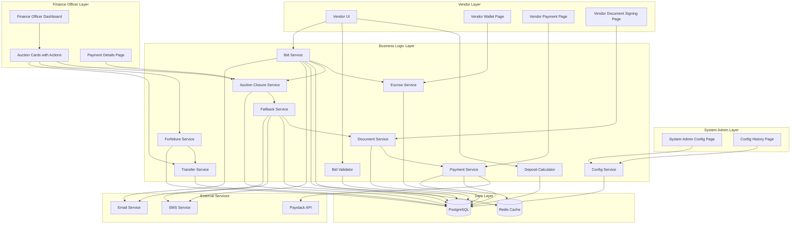
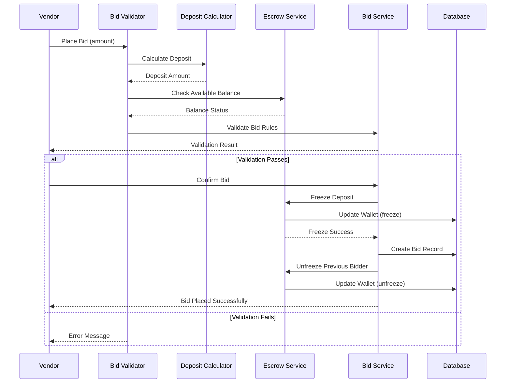
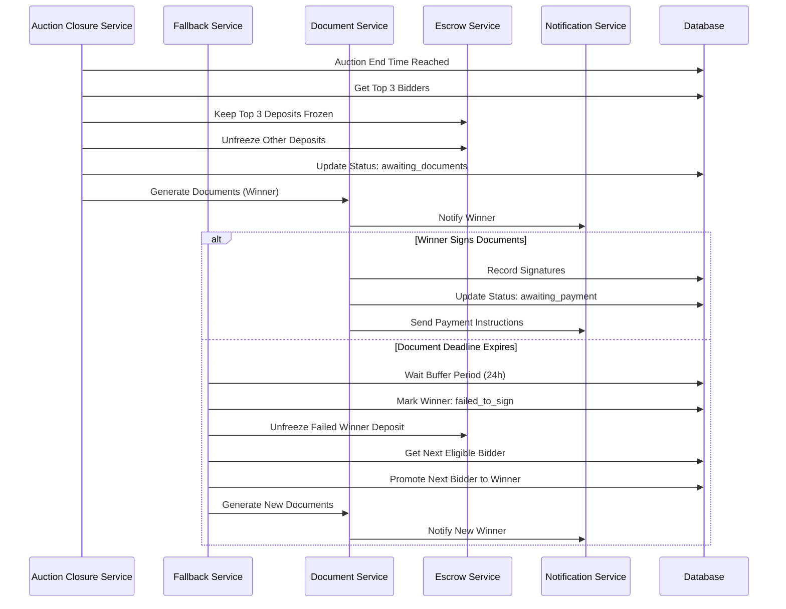
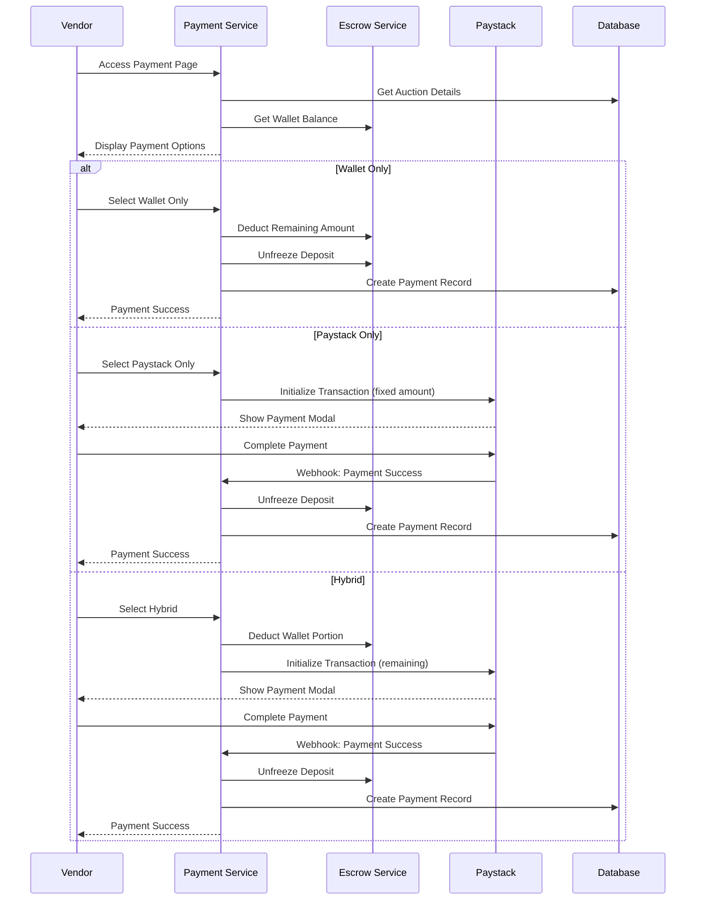
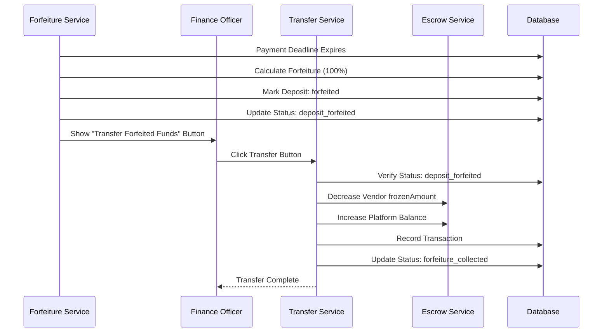

# Design Document: Auction Deposit Bidding System

## RESPONSIBLE DEVELOPMENT PRINCIPLES

This is an enterprise financial application that will handle millions to billions of Nigerian Naira. Every line of code must be written with the highest standards of responsibility and diligence.

### Core Principles:

1. **UNDERSTAND BEFORE CREATING**
   - Always check what already exists before creating new services, functions, or components
   - Search the codebase for similar functionality that can be reused or extended
   - Read existing implementations to understand patterns and architecture
   - Integration is preferred over duplication

2. **NO SHORTCUTS IN FINANCIAL LOGIC**
   - Every calculation involving money must be precise and tested
   - Deposit amounts, refunds, and transfers must be atomic and traceable
   - Never assume - always verify with actual database queries
   - Use transactions for all multi-step financial operations

3. **COMPREHENSIVE ERROR HANDLING**
   - Every service method must handle errors gracefully
   - Log all errors with sufficient context for debugging
   - Return meaningful error messages to users
   - Never silently fail on financial operations

4. **THOROUGH TESTING**
   - Unit tests must cover all edge cases, not just happy paths
   - Integration tests must verify actual database state
   - Test files must actually run and pass - fix Vitest/test runner issues immediately
   - Mock external dependencies but verify integration points

5. **AUDIT TRAIL EVERYTHING**
   - Every deposit, freeze, unfreeze, and refund must be logged
   - Include timestamps, user IDs, amounts, and reasons
   - Make it possible to reconstruct the complete history of any transaction
   - Compliance and debugging depend on comprehensive audit trails

6. **IDEMPOTENCY FOR CRITICAL OPERATIONS**
   - Auction closure, payment creation, and refunds must be idempotent
   - Prevent duplicate charges or refunds
   - Handle retries gracefully without side effects

7. **SECURITY FIRST**
   - Validate all inputs rigorously
   - Check authorization before any financial operation
   - Prevent SQL injection, XSS, and other common vulnerabilities
   - Sensitive data must be encrypted at rest and in transit

8. **PERFORMANCE WITH SCALE IN MIND**
   - Optimize database queries for thousands of concurrent auctions
   - Use indexes appropriately
   - Avoid N+1 queries
   - Consider caching for read-heavy operations

### Before Starting Any Task:

1. Read the existing codebase to understand what's already implemented
2. Identify integration points with existing services
3. **VERIFY REQUIREMENTS AGAINST IMPLEMENTATION** - Don't assume existing code meets requirements
4. Compare each acceptance criterion line-by-line against actual code behavior
5. Check database schemas for required fields before claiming functionality exists
6. Plan the implementation with error handling and edge cases in mind
7. Write tests that actually verify the behavior
8. Review the code as if millions of naira depend on it - because they do

### Remember:

- This is not a prototype or proof of concept
- Real users will trust this system with their money
- Bugs in financial logic can cause significant financial loss
- Your code will be audited by regulators and security experts
- Take the time to do it right the first time

---

## Overview

The Auction Deposit Bidding System transforms the current full-amount freeze model into a capital-efficient deposit-based model. Instead of freezing the entire bid amount, vendors freeze only a configurable percentage (default 10%, minimum ₦100,000) as deposit. This enables vendors to participate in multiple auctions simultaneously with limited capital.

The system implements an automated fallback chain that promotes the next eligible bidder when the winner fails to complete document signing or payment. Grace period extensions (maximum 2, each 24 hours) can be granted by Finance Officers through a dedicated UI. When a winner signs documents but fails to pay, their deposit is forfeited (default 100%) and transferred to the platform account via Finance Officer action.

Payment processing supports three modes: Wallet Only, Paystack Only, and Hybrid (wallet + Paystack). The Paystack modal appears after document signing with a pre-set, fixed amount that vendors cannot modify. All 12 business rules are configurable through a System Admin interface with validation and audit trail.

### Key Features

- Dynamic deposit calculation (10% of bid, min ₦100,000 floor)
- Deposit freeze/unfreeze mechanics in escrow wallet
- Top 3 bidders deposit retention after auction closes
- Automated fallback chain with 24-hour buffer periods
- Grace period extensions (2 max, 24 hours each) via Finance Officer UI
- Document signing flow (Bill of Sale, Liability Waiver only - 2 documents)
- Paystack payment modal integration (appears after document signing, amount is pre-set and fixed)
- Hybrid payment system (wallet + Paystack combination)
- Deposit forfeiture (100% default) when winner signs but doesn't pay
- Finance Officer button to transfer forfeited funds (only visible when deposit forfeited)
- System Admin configuration page for all 12 business rules
- Paystack withdrawal/refund mechanisms for losing bidders

### Technology Stack

- **Backend**: Next.js 14 App Router, TypeScript
- **Database**: PostgreSQL with Drizzle ORM
- **Payment Gateway**: Paystack
- **Real-time**: Socket.io
- **Caching**: Redis
- **UI**: React, Tailwind CSS, shadcn/ui

## Architecture

### System Components



### Data Flow

#### Bid Placement Flow



#### Auction Closure and Fallback Flow



#### Payment Flow



#### Forfeiture and Transfer Flow



## Components and Interfaces

### Core Services

#### Deposit Calculator

```typescript
interface DepositCalculator {
  /**
   * Calculate deposit amount for a bid
   * Formula: max(bid_amount × deposit_rate, minimum_deposit_floor)
   */
  calculateDeposit(
    bidAmount: number,
    depositRate: number,
    minimumDepositFloor: number
  ): number;
  
  /**
   * Calculate incremental deposit when vendor increases bid
   */
  calculateIncrementalDeposit(
    newBidAmount: number,
    previousBidAmount: number,
    depositRate: number,
    minimumDepositFloor: number
  ): number;
}
```

#### Bid Validator

```typescript
interface BidValidator {
  /**
   * Validate bid eligibility before placement
   */
  validateBid(params: {
    vendorId: string;
    auctionId: string;
    bidAmount: number;
    reservePrice: number;
    currentHighestBid: number | null;
    vendorTier: 'tier1_bvn' | 'tier2_cac';
    availableBalance: number;
    depositAmount: number;
  }): Promise<ValidationResult>;
}

interface ValidationResult {
  valid: boolean;
  errors: string[];
  depositAmount?: number;
}
```

#### Escrow Service

```typescript
interface EscrowService {
  /**
   * Freeze deposit amount in vendor's wallet
   */
  freezeDeposit(
    vendorId: string,
    amount: number,
    auctionId: string,
    userId: string
  ): Promise<void>;
  
  /**
   * Unfreeze deposit amount in vendor's wallet
   */
  unfreezeDeposit(
    vendorId: string,
    amount: number,
    auctionId: string,
    userId: string
  ): Promise<void>;
  
  /**
   * Get wallet balance details
   */
  getBalance(vendorId: string): Promise<{
    balance: number;
    availableBalance: number;
    frozenAmount: number;
    forfeitedAmount: number;
  }>;
  
  /**
   * Verify wallet invariant
   */
  verifyInvariant(walletId: string): Promise<boolean>;
}
```

#### Auction Closure Service

```typescript
interface AuctionClosureService {
  /**
   * Close auction and identify top N bidders
   */
  closeAuction(auctionId: string): Promise<{
    winnerId: string;
    topBidders: Array<{
      vendorId: string;
      bidAmount: number;
      depositAmount: number;
    }>;
  }>;
  
  /**
   * Unfreeze deposits for bidders not in top N
   */
  unfreezeNonTopBidders(
    auctionId: string,
    topBidderIds: string[]
  ): Promise<void>;
}
```

#### Fallback Service

```typescript
interface FallbackService {
  /**
   * Trigger fallback chain when winner fails
   */
  triggerFallback(
    auctionId: string,
    failureReason: 'failed_to_sign' | 'failed_to_pay'
  ): Promise<{
    success: boolean;
    nextWinnerId?: string;
    allFallbacksFailed?: boolean;
  }>;
  
  /**
   * Check if bidder is eligible for promotion
   */
  isEligibleForPromotion(
    vendorId: string,
    auctionId: string,
    requiredDeposit: number
  ): Promise<boolean>;
}
```

#### Document Service

```typescript
interface DocumentService {
  /**
   * Generate required documents for winner
   */
  generateDocuments(
    auctionId: string,
    winnerId: string
  ): Promise<{
    billOfSaleId: string;
    liabilityWaiverId: string;
    validityDeadline: Date;
  }>;
  
  /**
   * Record document signature
   */
  recordSignature(
    documentId: string,
    vendorId: string,
    signatureData: string
  ): Promise<void>;
  
  /**
   * Check if all documents are signed
   */
  areAllDocumentsSigned(auctionId: string): Promise<boolean>;
}
```

#### Payment Service

```typescript
interface PaymentService {
  /**
   * Calculate payment breakdown
   */
  calculatePaymentBreakdown(
    finalBid: number,
    depositAmount: number,
    availableBalance: number
  ): {
    finalBid: number;
    depositAmount: number;
    remainingAmount: number;
    availableBalance: number;
    walletPortion: number;
    paystackPortion: number;
  };
  
  /**
   * Process wallet-only payment
   */
  processWalletPayment(
    auctionId: string,
    vendorId: string,
    amount: number
  ): Promise<PaymentResult>;
  
  /**
   * Initialize Paystack transaction
   */
  initializePaystackPayment(
    auctionId: string,
    vendorId: string,
    amount: number
  ): Promise<{
    authorizationUrl: string;
    reference: string;
  }>;
  
  /**
   * Process hybrid payment
   */
  processHybridPayment(
    auctionId: string,
    vendorId: string,
    walletPortion: number,
    paystackPortion: number
  ): Promise<PaymentResult>;
  
  /**
   * Handle Paystack webhook
   */
  handlePaystackWebhook(
    reference: string,
    status: 'success' | 'failed'
  ): Promise<void>;
}

interface PaymentResult {
  success: boolean;
  paymentId?: string;
  error?: string;
}
```

#### Forfeiture Service

```typescript
interface ForfeitureService {
  /**
   * Forfeit deposit when payment deadline expires
   */
  forfeitDeposit(
    auctionId: string,
    vendorId: string,
    depositAmount: number,
    forfeiturePercentage: number
  ): Promise<{
    forfeitedAmount: number;
  }>;
}
```

#### Transfer Service

```typescript
interface TransferService {
  /**
   * Transfer forfeited funds to platform account
   */
  transferForfeitedFunds(
    auctionId: string,
    vendorId: string,
    forfeitedAmount: number,
    financeOfficerId: string
  ): Promise<void>;
}
```

#### Configuration Service

```typescript
interface ConfigService {
  /**
   * Get current system configuration
   */
  getConfig(): Promise<SystemConfig>;
  
  /**
   * Update configuration parameter
   */
  updateConfig(
    parameter: string,
    value: number | string,
    adminId: string,
    reason?: string
  ): Promise<void>;
  
  /**
   * Get configuration history
   */
  getConfigHistory(filters?: {
    parameter?: string;
    startDate?: Date;
    endDate?: Date;
    adminId?: string;
  }): Promise<ConfigChange[]>;
}

interface SystemConfig {
  depositRate: number; // 1-100%
  minimumDepositFloor: number; // min ₦1,000
  tier1Limit: number; // default ₦500,000
  minimumBidIncrement: number; // default ₦20,000
  documentValidityPeriod: number; // hours, default 48
  maxGraceExtensions: number; // default 2
  graceExtensionDuration: number; // hours, default 24
  fallbackBufferPeriod: number; // hours, default 24
  topBiddersToKeepFrozen: number; // default 3
  forfeiturePercentage: number; // 1-100%, default 100
  paymentDeadlineAfterSigning: number; // hours, default 72
  depositSystemEnabled: boolean; // feature flag
}

interface ConfigChange {
  id: string;
  parameter: string;
  oldValue: string;
  newValue: string;
  changedBy: string;
  changedAt: Date;
  reason?: string;
}
```

### UI Components

#### Finance Officer Dashboard Components

```typescript
// Auction Card with Action Buttons
interface AuctionCardProps {
  auction: {
    id: string;
    assetName: string;
    status: AuctionStatus;
    winnerId?: string;
    winnerName?: string;
    finalBid?: number;
    depositAmount?: number;
    forfeitedAmount?: number;
    documentDeadline?: Date;
    paymentDeadline?: Date;
    extensionCount?: number;
  };
  onGrantExtension?: (auctionId: string) => void;
  onTransferForfeitedFunds?: (auctionId: string) => void;
}

// Payment Details Page
interface PaymentDetailsPageProps {
  auctionId: string;
  auction: AuctionDetails;
  timeline: TimelineEvent[];
}

interface TimelineEvent {
  id: string;
  type: 'bid' | 'document' | 'payment' | 'fallback' | 'extension' | 'forfeiture';
  timestamp: Date;
  actor: string;
  description: string;
  metadata?: Record<string, any>;
}
```

#### Vendor UI Components

```typescript
// Deposit History Component
interface DepositHistoryProps {
  vendorId: string;
  deposits: DepositEvent[];
}

interface DepositEvent {
  id: string;
  auctionId: string;
  assetName: string;
  amount: number;
  type: 'freeze' | 'unfreeze' | 'forfeit';
  timestamp: Date;
}

// Payment Options Component
interface PaymentOptionsProps {
  finalBid: number;
  depositAmount: number;
  remainingAmount: number;
  availableBalance: number;
  onSelectPaymentMethod: (method: 'wallet' | 'paystack' | 'hybrid') => void;
}

// Document Signing Component
interface DocumentSigningProps {
  documents: Array<{
    id: string;
    type: 'bill_of_sale' | 'liability_waiver';
    status: 'pending' | 'signed';
    content: string;
  }>;
  deadline: Date;
  onSign: (documentId: string, signature: string) => void;
}
```

#### System Admin Components

```typescript
// Configuration Form Component
interface ConfigFormProps {
  config: SystemConfig;
  onSave: (updates: Partial<SystemConfig>, reason?: string) => void;
}

// Configuration History Component
interface ConfigHistoryProps {
  changes: ConfigChange[];
  filters: {
    parameter?: string;
    startDate?: Date;
    endDate?: Date;
    adminId?: string;
  };
  onFilterChange: (filters: any) => void;
}
```

## Data Models

### Database Schema Extensions

#### Bids Table Extension

```typescript
// Add to existing bids table
interface BidExtension {
  depositAmount: numeric; // Deposit frozen for this bid
  status: 'active' | 'outbid' | 'winner' | 'failed_to_sign' | 'failed_to_pay' | 'completed';
  isLegacy: boolean; // True for bids before deposit system
}
```

#### Escrow Wallets Table Extension

```typescript
// Add to existing escrow_wallets table
interface EscrowWalletExtension {
  forfeitedAmount: numeric; // Total forfeited deposits
}
```

#### New Tables

```sql
-- Auction Winners Table
CREATE TABLE auction_winners (
  id UUID PRIMARY KEY DEFAULT gen_random_uuid(),
  auction_id UUID NOT NULL REFERENCES auctions(id) ON DELETE CASCADE,
  vendor_id UUID NOT NULL REFERENCES vendors(id),
  bid_amount NUMERIC(12, 2) NOT NULL,
  deposit_amount NUMERIC(12, 2) NOT NULL,
  rank INTEGER NOT NULL, -- 1 = winner, 2-3 = fallback candidates
  status VARCHAR(50) NOT NULL, -- 'active', 'failed_to_sign', 'failed_to_pay', 'completed'
  promoted_at TIMESTAMP,
  failed_at TIMESTAMP,
  failure_reason VARCHAR(100),
  created_at TIMESTAMP NOT NULL DEFAULT NOW(),
  updated_at TIMESTAMP NOT NULL DEFAULT NOW()
);

CREATE INDEX idx_auction_winners_auction_id ON auction_winners(auction_id);
CREATE INDEX idx_auction_winners_vendor_id ON auction_winners(vendor_id);
CREATE INDEX idx_auction_winners_status ON auction_winners(status);

-- Documents Table
CREATE TABLE auction_documents (
  id UUID PRIMARY KEY DEFAULT gen_random_uuid(),
  auction_id UUID NOT NULL REFERENCES auctions(id) ON DELETE CASCADE,
  vendor_id UUID NOT NULL REFERENCES vendors(id),
  type VARCHAR(50) NOT NULL, -- 'bill_of_sale', 'liability_waiver'
  content TEXT NOT NULL,
  status VARCHAR(50) NOT NULL DEFAULT 'pending', -- 'pending', 'signed', 'voided'
  signed_at TIMESTAMP,
  signature_data TEXT,
  validity_deadline TIMESTAMP NOT NULL,
  created_at TIMESTAMP NOT NULL DEFAULT NOW(),
  updated_at TIMESTAMP NOT NULL DEFAULT NOW()
);

CREATE INDEX idx_auction_documents_auction_id ON auction_documents(auction_id);
CREATE INDEX idx_auction_documents_vendor_id ON auction_documents(vendor_id);
CREATE INDEX idx_auction_documents_status ON auction_documents(status);

-- Grace Extensions Table
CREATE TABLE grace_extensions (
  id UUID PRIMARY KEY DEFAULT gen_random_uuid(),
  auction_id UUID NOT NULL REFERENCES auctions(id) ON DELETE CASCADE,
  granted_by UUID NOT NULL REFERENCES users(id),
  extension_type VARCHAR(50) NOT NULL, -- 'document_signing', 'payment'
  duration_hours INTEGER NOT NULL,
  reason TEXT,
  old_deadline TIMESTAMP NOT NULL,
  new_deadline TIMESTAMP NOT NULL,
  created_at TIMESTAMP NOT NULL DEFAULT NOW()
);

CREATE INDEX idx_grace_extensions_auction_id ON grace_extensions(auction_id);
CREATE INDEX idx_grace_extensions_granted_by ON grace_extensions(granted_by);

-- Deposit Forfeitures Table
CREATE TABLE deposit_forfeitures (
  id UUID PRIMARY KEY DEFAULT gen_random_uuid(),
  auction_id UUID NOT NULL REFERENCES auctions(id) ON DELETE CASCADE,
  vendor_id UUID NOT NULL REFERENCES vendors(id),
  deposit_amount NUMERIC(12, 2) NOT NULL,
  forfeiture_percentage INTEGER NOT NULL,
  forfeited_amount NUMERIC(12, 2) NOT NULL,
  reason VARCHAR(100) NOT NULL,
  transferred_at TIMESTAMP,
  transferred_by UUID REFERENCES users(id),
  created_at TIMESTAMP NOT NULL DEFAULT NOW()
);

CREATE INDEX idx_deposit_forfeitures_auction_id ON deposit_forfeitures(auction_id);
CREATE INDEX idx_deposit_forfeitures_vendor_id ON deposit_forfeitures(vendor_id);

-- System Configuration Table
CREATE TABLE system_config (
  id UUID PRIMARY KEY DEFAULT gen_random_uuid(),
  parameter VARCHAR(100) NOT NULL UNIQUE,
  value TEXT NOT NULL,
  data_type VARCHAR(50) NOT NULL, -- 'number', 'boolean', 'string'
  description TEXT,
  min_value NUMERIC(12, 2),
  max_value NUMERIC(12, 2),
  updated_at TIMESTAMP NOT NULL DEFAULT NOW(),
  updated_by UUID REFERENCES users(id)
);

-- Configuration Change History Table
CREATE TABLE config_change_history (
  id UUID PRIMARY KEY DEFAULT gen_random_uuid(),
  parameter VARCHAR(100) NOT NULL,
  old_value TEXT NOT NULL,
  new_value TEXT NOT NULL,
  changed_by UUID NOT NULL REFERENCES users(id),
  reason TEXT,
  created_at TIMESTAMP NOT NULL DEFAULT NOW()
);

CREATE INDEX idx_config_change_history_parameter ON config_change_history(parameter);
CREATE INDEX idx_config_change_history_changed_by ON config_change_history(changed_by);
CREATE INDEX idx_config_change_history_created_at ON config_change_history(created_at DESC);

-- Deposit Events Table (for vendor transparency)
CREATE TABLE deposit_events (
  id UUID PRIMARY KEY DEFAULT gen_random_uuid(),
  vendor_id UUID NOT NULL REFERENCES vendors(id),
  auction_id UUID NOT NULL REFERENCES auctions(id) ON DELETE CASCADE,
  event_type VARCHAR(50) NOT NULL, -- 'freeze', 'unfreeze', 'forfeit'
  amount NUMERIC(12, 2) NOT NULL,
  balance_after NUMERIC(12, 2) NOT NULL,
  frozen_after NUMERIC(12, 2) NOT NULL,
  description TEXT NOT NULL,
  created_at TIMESTAMP NOT NULL DEFAULT NOW()
);

CREATE INDEX idx_deposit_events_vendor_id ON deposit_events(vendor_id);
CREATE INDEX idx_deposit_events_auction_id ON deposit_events(auction_id);
CREATE INDEX idx_deposit_events_created_at ON deposit_events(created_at DESC);
```

### Auction Status State Machine

```typescript
type AuctionStatus = 
  | 'scheduled'
  | 'active'
  | 'extended'
  | 'closed'
  | 'awaiting_documents'
  | 'awaiting_payment'
  | 'deposit_forfeited'
  | 'forfeiture_collected'
  | 'failed_all_fallbacks'
  | 'manual_resolution'
  | 'paid'
  | 'completed'
  | 'cancelled';

// Valid state transitions
const validTransitions: Record<AuctionStatus, AuctionStatus[]> = {
  scheduled: ['active', 'cancelled'],
  active: ['extended', 'closed', 'cancelled'],
  extended: ['closed', 'cancelled'],
  closed: ['awaiting_documents', 'failed_all_fallbacks'],
  awaiting_documents: ['awaiting_payment', 'awaiting_documents', 'failed_all_fallbacks'],
  awaiting_payment: ['paid', 'deposit_forfeited', 'awaiting_documents'],
  deposit_forfeited: ['forfeiture_collected', 'awaiting_documents'],
  forfeiture_collected: ['awaiting_documents', 'failed_all_fallbacks'],
  failed_all_fallbacks: ['manual_resolution', 'cancelled'],
  manual_resolution: ['awaiting_documents', 'cancelled'],
  paid: ['completed'],
  completed: [],
  cancelled: []
};
```


## Correctness Properties

*A property is a characteristic or behavior that should hold true across all valid executions of a system—essentially, a formal statement about what the system should do. Properties serve as the bridge between human-readable specifications and machine-verifiable correctness guarantees.*

### Property Reflection

After analyzing all acceptance criteria, I identified the following redundancies:

- Properties 3.1 and 3.2 (freeze increases frozenAmount and decreases availableBalance) can be combined with the wallet invariant property
- Properties 4.1 and 4.2 (unfreeze decreases frozenAmount and increases availableBalance) can be combined with the wallet invariant property
- Properties 3.6, 4.5, and 26.1 all test the same wallet invariant and should be consolidated into one comprehensive property
- Properties 14.2, 14.3, 15.3, and 16.5 all test deposit unfreezing after payment and can be combined
- Properties 8.4 and 13.3 test the same remaining amount calculation
- Properties 16.1 and 16.2 test hybrid payment calculation and can be combined
- Properties 25.1 and 25.3 test parsing and printing separately, but 25.4 subsumes both with the round-trip property

### Property 1: Deposit Calculation Formula

*For any* bid amount, deposit rate, and minimum deposit floor, the calculated deposit should equal max(bid_amount × deposit_rate, minimum_deposit_floor) and be a non-negative integer value in Naira.

**Validates: Requirements 1.1, 1.6**

### Property 2: Tier 1 Deposit Cap

*For any* Tier 1 vendor bid up to ₦500,000, the calculated deposit should never exceed ₦50,000 (10% of tier limit).

**Validates: Requirements 1.4**

### Property 3: Incremental Deposit Calculation

*For any* vendor who increases their bid on the same auction, the incremental deposit should equal (new_deposit - previous_deposit) where new_deposit and previous_deposit are calculated using the deposit formula.

**Validates: Requirements 1.5**

### Property 4: Bid Validation Rules

*For any* bid attempt, validation should fail if and only if: (1) availableBalance < required deposit, OR (2) bid < reserve_price, OR (3) bid < current_highest_bid + ₦20,000, OR (4) vendor is Tier 1 AND bid > ₦500,000.

**Validates: Requirements 2.1**

### Property 5: Escrow Wallet Invariant

*For any* escrow wallet operation (freeze, unfreeze, forfeit, transfer), the invariant balance = availableBalance + frozenAmount + forfeitedAmount must hold before and after the operation.

**Validates: Requirements 3.6, 4.5, 26.1, 26.2**

### Property 6: Deposit Freeze State Changes

*For any* valid bid placement, after freezing the deposit: (1) frozenAmount increases by deposit_amount, (2) availableBalance decreases by deposit_amount, (3) balance remains unchanged, and (4) the wallet invariant holds.

**Validates: Requirements 3.1, 3.2**

### Property 7: Incremental Freeze for Bid Increases

*For any* vendor who increases their existing bid, only the incremental deposit amount should be frozen (not the full new deposit).

**Validates: Requirements 3.3**

### Property 8: Deposit Unfreeze on Outbid

*For any* vendor who is outbid, after unfreezing their deposit: (1) frozenAmount decreases by their deposit_amount, (2) availableBalance increases by their deposit_amount, (3) balance remains unchanged, and (4) the wallet invariant holds.

**Validates: Requirements 4.1, 4.2**

### Property 9: Re-bid After Outbid

*For any* vendor who places a new higher bid after being outbid, the system should freeze the new deposit amount and the wallet invariant should hold.

**Validates: Requirements 4.4**

### Property 10: Top N Bidders Identification

*For any* auction with M bidders where M >= N, closing the auction should identify exactly N bidders with the highest bid amounts, ranked in descending order.

**Validates: Requirements 5.1, 5.6**

### Property 11: Top N Deposits Remain Frozen

*For any* auction closure, the deposits of the top N bidders should remain frozen while all other bidders' deposits should be unfrozen.

**Validates: Requirements 5.2, 5.3**

### Property 12: Document Validity Deadline Calculation

*For any* document generation, the validity deadline should equal current_time + document_validity_period (in hours).

**Validates: Requirements 6.3**

### Property 13: Extension Count Validation

*For any* grace extension request, the extension should be granted if and only if extensionCount < max_grace_extensions.

**Validates: Requirements 7.2**

### Property 14: Extension Deadline Calculation

*For any* granted extension, the new deadline should equal old_deadline + grace_extension_duration (in hours).

**Validates: Requirements 7.3**

### Property 15: Remaining Payment Amount Calculation

*For any* auction where documents are signed, the remaining payment amount should equal final_bid - deposit_amount.

**Validates: Requirements 8.4, 13.3**

### Property 16: Payment Deadline Calculation

*For any* document signing completion, the payment deadline should equal current_time + payment_deadline_after_signing (in hours).

**Validates: Requirements 8.5**

### Property 17: Failed Winner Deposit Unfreeze

*For any* winner who fails to sign documents or pay, their deposit should be unfrozen (unless forfeited).

**Validates: Requirements 9.3**

### Property 18: Next Eligible Bidder Identification

*For any* fallback scenario, the next eligible bidder should be the highest-ranked bidder from the top N who: (1) has deposit still frozen, AND (2) has availableBalance >= required deposit.

**Validates: Requirements 9.4, 10.1, 10.2**

### Property 19: Fallback Chain Skips Ineligible Bidders

*For any* fallback chain execution, if a bidder is ineligible, the system should skip to the next bidder in ranking until an eligible bidder is found or all bidders are exhausted.

**Validates: Requirements 10.3**

### Property 20: All Deposits Unfrozen When All Fallbacks Fail

*For any* auction where all top N bidders are ineligible or have failed, all remaining frozen deposits should be unfrozen.

**Validates: Requirements 10.5, 30.2**

### Property 21: Forfeiture Amount Calculation

*For any* payment failure after document signing, the forfeiture amount should equal deposit_amount × (forfeiture_percentage / 100).

**Validates: Requirements 11.1**

### Property 22: Forfeited Deposit Remains Frozen

*For any* deposit forfeiture, the forfeited amount should remain in frozenAmount (not unfrozen) until transferred.

**Validates: Requirements 11.2**

### Property 23: Forfeited Funds Transfer State Changes

*For any* forfeited funds transfer: (1) vendor's frozenAmount decreases by forfeitedAmount, (2) platform balance increases by forfeitedAmount, and (3) the wallet invariant holds.

**Validates: Requirements 12.3, 12.4**

### Property 24: Remaining Frozen Amount After Forfeiture

*For any* forfeiture where deposit_amount > forfeited_amount, the remaining frozen amount (deposit_amount - forfeited_amount) should stay frozen until auction is resolved.

**Validates: Requirements 12.7**

### Property 25: Wallet Payment Validation

*For any* wallet-only payment attempt, the payment should succeed if and only if availableBalance >= remaining_amount.

**Validates: Requirements 14.1**

### Property 26: Wallet Payment State Changes

*For any* successful wallet-only payment: (1) availableBalance decreases by remaining_amount, (2) frozenAmount decreases by deposit_amount, (3) balance decreases by final_bid, and (4) the wallet invariant holds.

**Validates: Requirements 14.2, 14.3**

### Property 27: Deposit Unfreeze After Payment

*For any* successful payment (wallet, Paystack, or hybrid), the deposit amount should be unfrozen from the vendor's wallet.

**Validates: Requirements 14.3, 15.3, 16.5**

### Property 28: Hybrid Payment Wallet Portion Calculation

*For any* hybrid payment, the wallet portion should equal min(availableBalance, remaining_amount).

**Validates: Requirements 16.1**

### Property 29: Hybrid Payment Paystack Portion Calculation

*For any* hybrid payment, the Paystack portion should equal remaining_amount - wallet_portion.

**Validates: Requirements 16.2**

### Property 30: Hybrid Payment Rollback on Failure

*For any* hybrid payment where Paystack fails after wallet deduction, the wallet portion should be refunded to availableBalance and the wallet invariant should hold.

**Validates: Requirements 16.7**

### Property 31: Configuration Round-Trip

*For any* valid SystemConfig object, parsing then printing then parsing should produce an equivalent object (parse(print(parse(config))) = parse(config)).

**Validates: Requirements 25.4**

### Property 32: Configuration Validation on Import

*For any* configuration import, all values should be validated against business rule constraints (e.g., deposit_rate in 1-100%, minimum_deposit_floor >= ₦1,000).

**Validates: Requirements 25.6**

### Property 33: Payment Idempotency

*For any* payment submission with an existing idempotency key, the system should return the original payment result without reprocessing.

**Validates: Requirements 28.2**

### Property 34: Webhook Idempotency

*For any* Paystack webhook received multiple times for the same transaction, the system should process it only once.

**Validates: Requirements 28.3**

## Error Handling

### Error Categories

1. **Validation Errors**: Returned to user with descriptive message
   - Insufficient balance
   - Bid below reserve price
   - Bid increment too small
   - Tier 1 limit exceeded
   - Extension limit reached
   - Invalid configuration values

2. **Business Logic Errors**: Logged and handled gracefully
   - Wallet invariant violation
   - Concurrent bid conflicts
   - Fallback chain exhaustion
   - Payment processing failures

3. **External Service Errors**: Retried with exponential backoff
   - Paystack API failures
   - SMS/Email delivery failures
   - Redis connection errors

4. **Critical Errors**: Alerted to administrators
   - Wallet invariant violations
   - Database transaction failures
   - Data corruption detected

### Error Recovery Strategies

#### Deposit Freeze Failure

```typescript
try {
  await escrowService.freezeDeposit(vendorId, depositAmount, auctionId, userId);
  await bidService.createBid(bidData);
} catch (error) {
  // Rollback: Do not create bid record
  // Return error to vendor
  return { success: false, error: 'Failed to freeze deposit' };
}
```

#### Hybrid Payment Failure

```typescript
try {
  // Step 1: Deduct wallet portion
  await escrowService.deductFromWallet(vendorId, walletPortion);
  
  try {
    // Step 2: Process Paystack payment
    await paystackService.processPayment(paystackPortion);
  } catch (paystackError) {
    // Rollback: Refund wallet portion
    await escrowService.refundToWallet(vendorId, walletPortion);
    return { success: false, error: 'Paystack payment failed. Wallet refunded.' };
  }
} catch (walletError) {
  return { success: false, error: 'Insufficient wallet balance' };
}
```

#### Wallet Invariant Violation

```typescript
async function verifyWalletInvariant(walletId: string): Promise<void> {
  const wallet = await db.query.escrowWallets.findFirst({
    where: eq(escrowWallets.id, walletId)
  });
  
  const expectedBalance = 
    parseFloat(wallet.availableBalance) + 
    parseFloat(wallet.frozenAmount) + 
    parseFloat(wallet.forfeitedAmount);
  
  const actualBalance = parseFloat(wallet.balance);
  
  if (Math.abs(expectedBalance - actualBalance) > 0.01) {
    // Log critical error
    await logCriticalError({
      type: 'WALLET_INVARIANT_VIOLATION',
      walletId,
      expectedBalance,
      actualBalance,
      difference: actualBalance - expectedBalance
    });
    
    // Alert administrators
    await alertAdministrators({
      severity: 'CRITICAL',
      message: `Wallet invariant violation detected for wallet ${walletId}`
    });
    
    // Rollback transaction
    throw new Error('Wallet invariant violation detected');
  }
}
```

#### Concurrent Bid Handling

```typescript
async function placeBidWithLocking(bidData: PlaceBidData): Promise<PlaceBidResult> {
  return await db.transaction(async (tx) => {
    // Lock auction row
    const auction = await tx
      .select()
      .from(auctions)
      .where(eq(auctions.id, bidData.auctionId))
      .for('update')
      .limit(1);
    
    // Lock vendor wallet row
    const wallet = await tx
      .select()
      .from(escrowWallets)
      .where(eq(escrowWallets.vendorId, bidData.vendorId))
      .for('update')
      .limit(1);
    
    // Re-validate bid with locked data
    const validation = await validateBid(bidData, auction[0], wallet[0]);
    if (!validation.valid) {
      throw new Error(validation.errors[0]);
    }
    
    // Process bid
    await freezeDeposit(tx, bidData);
    await createBid(tx, bidData);
    await unfreezeePreviousBidder(tx, auction[0].currentBidder);
    
    return { success: true };
  });
}
```

### Timeout Handling

- **Bid Placement**: 10 second timeout
- **Payment Processing**: 30 second timeout
- **Paystack API**: 15 second timeout with 3 retries
- **Database Queries**: 5 second timeout
- **Lock Acquisition**: 2 second timeout

## Testing Strategy

### Dual Testing Approach

The system requires both unit tests and property-based tests for comprehensive coverage:

- **Unit tests**: Verify specific examples, edge cases, and error conditions
- **Property tests**: Verify universal properties across all inputs

Together, they provide comprehensive coverage where unit tests catch concrete bugs and property tests verify general correctness.

### Property-Based Testing Configuration

We will use **fast-check** (JavaScript/TypeScript property-based testing library) with the following configuration:

- **Minimum 100 iterations per property test** (due to randomization)
- **Each property test must reference its design document property**
- **Tag format**: `Feature: auction-deposit-bidding-system, Property {number}: {property_text}`

### Unit Testing Focus

Unit tests should focus on:

- Specific examples that demonstrate correct behavior
- Integration points between components
- Edge cases (e.g., auctions with fewer than N bidders, deposit equals minimum floor)
- Error conditions (e.g., insufficient balance, invalid configuration)

Avoid writing too many unit tests for scenarios that property tests already cover comprehensively.

### Property Test Examples

#### Property 1: Deposit Calculation Formula

```typescript
import fc from 'fast-check';

describe('Feature: auction-deposit-bidding-system, Property 1: Deposit Calculation Formula', () => {
  it('should calculate deposit as max(bid × rate, floor) for all inputs', () => {
    fc.assert(
      fc.property(
        fc.integer({ min: 100000, max: 10000000 }), // bid amount
        fc.integer({ min: 1, max: 100 }), // deposit rate (%)
        fc.integer({ min: 1000, max: 500000 }), // minimum floor
        (bidAmount, depositRate, minimumFloor) => {
          const result = depositCalculator.calculateDeposit(
            bidAmount,
            depositRate / 100,
            minimumFloor
          );
          
          const expected = Math.max(
            Math.ceil(bidAmount * (depositRate / 100)),
            minimumFloor
          );
          
          expect(result).toBe(expected);
          expect(result).toBeGreaterThanOrEqual(0);
          expect(Number.isInteger(result)).toBe(true);
        }
      ),
      { numRuns: 100 }
    );
  });
});
```

#### Property 5: Escrow Wallet Invariant

```typescript
describe('Feature: auction-deposit-bidding-system, Property 5: Escrow Wallet Invariant', () => {
  it('should maintain balance = available + frozen + forfeited after all operations', () => {
    fc.assert(
      fc.property(
        fc.record({
          operation: fc.constantFrom('freeze', 'unfreeze', 'forfeit', 'transfer'),
          amount: fc.integer({ min: 1000, max: 1000000 }),
          initialBalance: fc.integer({ min: 1000000, max: 10000000 }),
          initialFrozen: fc.integer({ min: 0, max: 1000000 }),
          initialForfeited: fc.integer({ min: 0, max: 100000 })
        }),
        async (scenario) => {
          // Setup wallet
          const wallet = await setupTestWallet({
            balance: scenario.initialBalance,
            frozenAmount: scenario.initialFrozen,
            forfeitedAmount: scenario.initialForfeited,
            availableBalance: scenario.initialBalance - scenario.initialFrozen - scenario.initialForfeited
          });
          
          // Verify initial invariant
          expect(wallet.balance).toBe(
            wallet.availableBalance + wallet.frozenAmount + wallet.forfeitedAmount
          );
          
          // Perform operation
          switch (scenario.operation) {
            case 'freeze':
              if (wallet.availableBalance >= scenario.amount) {
                await escrowService.freezeDeposit(wallet.vendorId, scenario.amount, 'test-auction', 'test-user');
              }
              break;
            case 'unfreeze':
              if (wallet.frozenAmount >= scenario.amount) {
                await escrowService.unfreezeDeposit(wallet.vendorId, scenario.amount, 'test-auction', 'test-user');
              }
              break;
            // ... other operations
          }
          
          // Verify invariant after operation
          const updatedWallet = await escrowService.getBalance(wallet.vendorId);
          expect(updatedWallet.balance).toBe(
            updatedWallet.availableBalance + updatedWallet.frozenAmount + updatedWallet.forfeitedAmount
          );
        }
      ),
      { numRuns: 100 }
    );
  });
});
```

#### Property 31: Configuration Round-Trip

```typescript
describe('Feature: auction-deposit-bidding-system, Property 31: Configuration Round-Trip', () => {
  it('should preserve config through parse-print-parse cycle', () => {
    fc.assert(
      fc.property(
        fc.record({
          depositRate: fc.integer({ min: 1, max: 100 }),
          minimumDepositFloor: fc.integer({ min: 1000, max: 1000000 }),
          tier1Limit: fc.integer({ min: 100000, max: 1000000 }),
          minimumBidIncrement: fc.integer({ min: 1000, max: 50000 }),
          documentValidityPeriod: fc.integer({ min: 1, max: 168 }),
          maxGraceExtensions: fc.integer({ min: 0, max: 5 }),
          graceExtensionDuration: fc.integer({ min: 1, max: 72 }),
          fallbackBufferPeriod: fc.integer({ min: 1, max: 72 }),
          topBiddersToKeepFrozen: fc.integer({ min: 1, max: 10 }),
          forfeiturePercentage: fc.integer({ min: 0, max: 100 }),
          paymentDeadlineAfterSigning: fc.integer({ min: 1, max: 168 }),
          depositSystemEnabled: fc.boolean()
        }),
        (config) => {
          // Print config to string
          const configString = configPrettyPrinter.format(config);
          
          // Parse string back to object
          const parsed1 = configParser.parse(configString);
          
          // Print again
          const configString2 = configPrettyPrinter.format(parsed1);
          
          // Parse again
          const parsed2 = configParser.parse(configString2);
          
          // Verify equivalence
          expect(parsed2).toEqual(parsed1);
          expect(parsed2).toEqual(config);
        }
      ),
      { numRuns: 100 }
    );
  });
});
```

### Integration Testing

Integration tests should cover:

- End-to-end bid placement flow (validation → freeze → create bid → unfreeze previous)
- Auction closure flow (identify top N → freeze/unfreeze deposits → generate documents)
- Fallback chain flow (winner fails → wait buffer → promote next → repeat)
- Payment flow (document signing → payment calculation → Paystack integration → deposit unfreeze)
- Forfeiture flow (payment failure → calculate forfeiture → transfer funds)

### Edge Cases to Test

1. **Auctions with fewer than N bidders**: All bidders' deposits should remain frozen
2. **Deposit equals minimum floor**: Should use minimum floor value
3. **Tier 1 vendor at limit**: Deposit should be exactly ₦50,000 for ₦500,000 bid
4. **All fallback bidders ineligible**: Auction should be marked "failed_all_fallbacks"
5. **Hybrid payment with zero wallet balance**: Should process as Paystack-only
6. **Hybrid payment with wallet balance > remaining amount**: Should process as wallet-only
7. **Extension limit reached**: Should disable extension button
8. **Concurrent bids on same auction**: Should process sequentially with locking
9. **Paystack webhook received multiple times**: Should process only once
10. **Configuration value at boundary**: Should validate correctly (e.g., deposit_rate = 1% or 100%)

### Performance Testing

- **Bid placement**: Should complete within 2 seconds (including deposit freeze)
- **Auction closure**: Should process within 5 seconds for auctions with up to 100 bidders
- **Fallback chain**: Should promote next bidder within 10 seconds
- **Payment processing**: Should complete within 5 seconds (excluding Paystack API time)
- **Configuration update**: Should apply within 1 second

### Security Testing

- **SQL Injection**: All database queries use parameterized statements
- **Race Conditions**: All critical operations use database-level locking
- **Idempotency**: Payment operations are idempotent with unique keys
- **Authorization**: Finance Officer actions require proper role verification
- **Audit Trail**: All configuration changes and financial operations are logged

