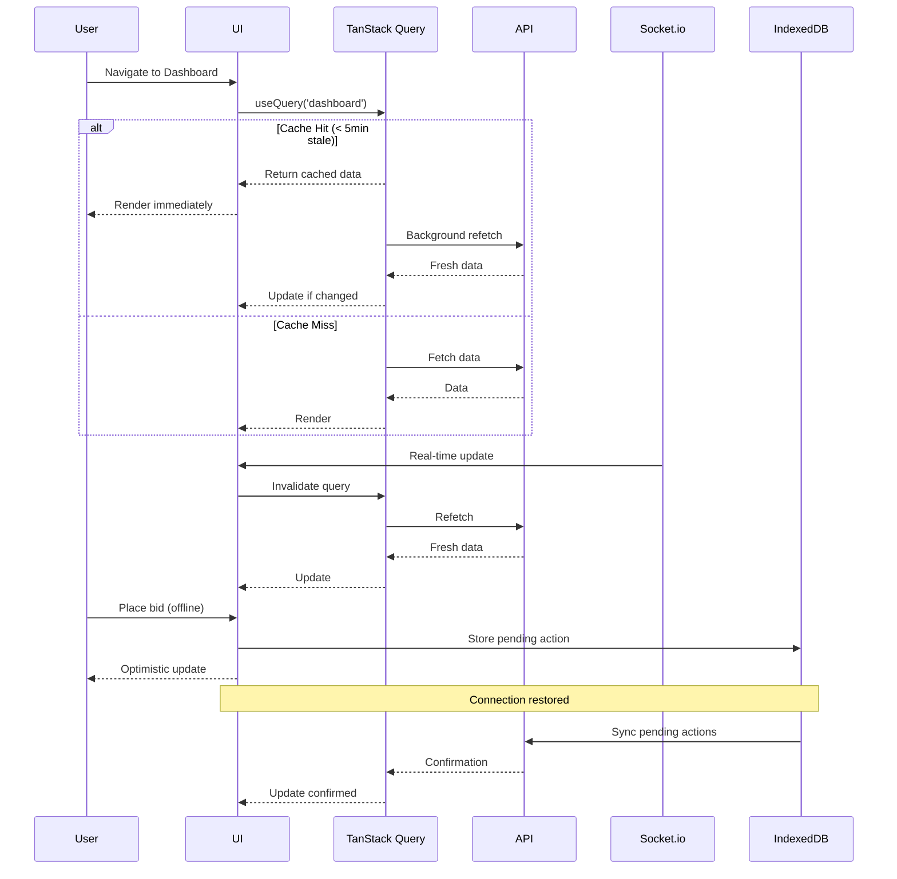

# Design Document: Enterprise UI/UX and Performance Modernization

## Overview

This design document outlines the technical approach for modernizing the salvage auction PWA to 2026 enterprise standards. The modernization addresses three critical areas:

1. **Performance Optimization**: Reducing page load times from 3-10 seconds to under 2 seconds through TanStack Query caching, code splitting, virtualized lists, and optimized Socket.io connections
2. **UI/UX Modernization**: Replacing emoji-heavy interface with professional Lucide React icons, implementing modern filter UI with faceted navigation, reducing card verbosity, and adding comprehensive skeleton loaders
3. **Mobile Optimization**: Implementing touch-friendly controls with 44x44px minimum touch targets, thumb-zone positioning, swipe gestures, and responsive layouts

The design follows an incremental migration strategy with feature flags to ensure zero breaking changes. All existing functionality remains intact while new patterns are introduced alongside old ones.

### Key Design Principles

- **Incremental Migration**: Add new patterns alongside old ones, migrate gradually
- **Feature Flags**: Wrap major UI changes for safe rollout (10% → 50% → 100%)
- **Backward Compatibility**: Maintain all existing API contracts and data structures
- **Type Safety**: Run diagnostics on every file touched
- **Performance Budget**: 2s initial load, 500ms navigation, 10s case creation
- **Accessibility First**: WCAG 2.1 Level AA compliance with keyboard navigation and screen reader support
- **Mobile First**: Design for mobile, enhance for desktop

## Architecture

### High-Level Architecture

```
┌─────────────────────────────────────────────────────────────┐
│                     Next.js 14 App Router                    │
├─────────────────────────────────────────────────────────────┤
│  ┌──────────────┐  ┌──────────────┐  ┌──────────────┐     │
│  │   Vendor     │  │   Manager    │  │   Adjuster   │     │
│  │  Dashboard   │  │  Dashboard   │  │  Dashboard   │     │
│  └──────┬───────┘  └──────┬───────┘  └──────┬───────┘     │
│         │                  │                  │              │
│         └──────────────────┴──────────────────┘              │
│                            │                                 │
├────────────────────────────┼─────────────────────────────────┤
│         Data Layer         │                                 │
│  ┌─────────────────────────▼──────────────────────────┐    │
│  │         TanStack Query (Server State)              │    │
│  │  - 5min stale time, 10min garbage collection       │    │
│  │  - Optimistic updates, automatic invalidation      │    │
│  │  - Request deduplication, background refetch       │    │
│  └─────────────────────────┬──────────────────────────┘    │
│                            │                                 │
│  ┌─────────────────────────▼──────────────────────────┐    │
│  │      Socket.io Manager (Real-Time State)           │    │
│  │  - Connection pooling (1 per session)              │    │
│  │  - Selective subscriptions, event deduplication    │    │
│  │  - Exponential backoff, heartbeat ping (25s)       │    │
│  └─────────────────────────┬──────────────────────────┘    │
│                            │                                 │
│  ┌─────────────────────────▼──────────────────────────┐    │
│  │       IndexedDB (Offline State)                     │    │
│  │  - Pending changes queue, last sync timestamp      │    │
│  │  - Background sync on reconnection                 │    │
│  └────────────────────────────────────────────────────┘    │
└─────────────────────────────────────────────────────────────┘
```


### Data Flow Architecture



### Component Architecture

```
src/
├── app/
│   ├── (dashboard)/
│   │   ├── vendor/
│   │   │   ├── dashboard/
│   │   │   │   └── page.tsx (dynamic import)
│   │   │   ├── auctions/
│   │   │   │   └── page.tsx (dynamic import)
│   │   │   └── wallet/
│   │   │       └── page.tsx (existing, no changes)
│   │   ├── manager/
│   │   │   └── dashboard/
│   │   │       └── page.tsx (dynamic import)
│   │   ├── adjuster/
│   │   │   ├── dashboard/
│   │   │   │   └── page.tsx (dynamic import)
│   │   │   └── cases/
│   │   │       └── page.tsx (redesign with filters)
│   │   ├── finance/
│   │   │   └── dashboard/
│   │   │       └── page.tsx (dynamic import)
│   │   └── admin/
│   │       └── dashboard/
│   │           └── page.tsx (dynamic import)
│   └── api/
│       └── dashboard/
│           ├── vendor/
│           │   └── route.ts (batched endpoint)
│           ├── manager/
│           │   └── route.ts (batched endpoint)
│           └── adjuster/
│               └── route.ts (batched endpoint)
├── components/
│   ├── ui/
│   │   ├── skeleton/
│   │   │   ├── card-skeleton.tsx
│   │   │   ├── list-skeleton.tsx
│   │   │   ├── dashboard-skeleton.tsx
│   │   │   └── chart-skeleton.tsx
│   │   ├── filters/
│   │   │   ├── filter-chip.tsx
│   │   │   ├── faceted-filter.tsx
│   │   │   ├── filter-dropdown.tsx
│   │   │   └── search-input.tsx
│   │   ├── icons/
│   │   │   └── icon-replacer.tsx (emoji → Lucide mapping)
│   │   └── virtualized-list/
│   │       └── virtualized-list.tsx
│   ├── vendor/
│   │   └── (existing components)
│   ├── manager/
│   │   └── (existing components)
│   └── adjuster/
│       └── (existing components)
├── hooks/
│   ├── queries/
│   │   ├── use-vendor-dashboard.ts
│   │   ├── use-manager-dashboard.ts
│   │   ├── use-adjuster-dashboard.ts
│   │   ├── use-cases.ts
│   │   ├── use-auctions.ts
│   │   └── use-vendors.ts
│   ├── use-socket.ts (optimize existing)
│   ├── use-optimistic-update.ts
│   └── use-virtualized-list.ts
├── lib/
│   ├── query-client.ts (TanStack Query config)
│   ├── socket/
│   │   ├── manager.ts (connection pooling)
│   │   └── deduplicator.ts (event deduplication)
│   └── performance/
│       ├── monitor.ts (RUM metrics)
│       └── error-tracker.ts
└── utils/
    ├── emoji-to-icon-map.ts
    └── image-optimizer.ts
```


## Components and Interfaces

### 1. TanStack Query Integration

#### QueryClientProvider Setup

```typescript
// lib/query-client.ts
import { QueryClient } from '@tanstack/react-query';

export const queryClient = new QueryClient({
  defaultOptions: {
    queries: {
      staleTime: 5 * 60 * 1000, // 5 minutes
      gcTime: 10 * 60 * 1000, // 10 minutes (formerly cacheTime)
      refetchOnWindowFocus: true,
      refetchOnReconnect: true,
      retry: 3,
      retryDelay: (attemptIndex) => Math.min(1000 * 2 ** attemptIndex, 30000),
    },
    mutations: {
      retry: 3,
      retryDelay: (attemptIndex) => Math.min(1000 * 2 ** attemptIndex, 30000),
    },
  },
});
```

#### Custom Query Hooks

```typescript
// hooks/queries/use-vendor-dashboard.ts
import { useQuery } from '@tanstack/react-query';

interface VendorDashboardData {
  performanceStats: PerformanceStats;
  badges: Badge[];
  comparisons: Comparison[];
  pendingPickupConfirmations: PendingPickupConfirmation[];
  vendorTier: VendorTier;
  bidLimit?: number;
}

export function useVendorDashboard() {
  return useQuery({
    queryKey: ['vendor', 'dashboard'],
    queryFn: async () => {
      const response = await fetch('/api/dashboard/vendor');
      if (!response.ok) throw new Error('Failed to fetch dashboard');
      return response.json() as Promise<VendorDashboardData>;
    },
    staleTime: 5 * 60 * 1000,
  });
}

// hooks/queries/use-cases.ts
export function useCases(filters?: CaseFilters) {
  return useQuery({
    queryKey: ['cases', filters],
    queryFn: async () => {
      const params = new URLSearchParams(filters as any);
      const response = await fetch(`/api/cases?${params}`);
      if (!response.ok) throw new Error('Failed to fetch cases');
      return response.json() as Promise<Case[]>;
    },
  });
}

// hooks/queries/use-case-mutation.ts
export function useCreateCase() {
  const queryClient = useQueryClient();
  
  return useMutation({
    mutationFn: async (caseData: CreateCaseInput) => {
      const response = await fetch('/api/cases', {
        method: 'POST',
        headers: { 'Content-Type': 'application/json' },
        body: JSON.stringify(caseData),
      });
      if (!response.ok) throw new Error('Failed to create case');
      return response.json();
    },
    onMutate: async (newCase) => {
      // Optimistic update
      await queryClient.cancelQueries({ queryKey: ['cases'] });
      const previousCases = queryClient.getQueryData(['cases']);
      
      queryClient.setQueryData(['cases'], (old: Case[]) => [
        { ...newCase, id: 'temp-id', status: 'pending' },
        ...old,
      ]);
      
      return { previousCases };
    },
    onError: (err, newCase, context) => {
      // Rollback on error
      queryClient.setQueryData(['cases'], context?.previousCases);
    },
    onSuccess: () => {
      // Invalidate and refetch
      queryClient.invalidateQueries({ queryKey: ['cases'] });
    },
  });
}
```

### 2. Socket.io Optimization

#### Connection Manager

```typescript
// lib/socket/manager.ts
import { io, Socket } from 'socket.io-client';

class SocketManager {
  private static instance: SocketManager;
  private socket: Socket | null = null;
  private subscriptions = new Map<string, Set<string>>();
  private eventCache = new Map<string, { hash: string; timestamp: number }>();
  private heartbeatInterval: NodeJS.Timeout | null = null;

  private constructor() {}

  static getInstance(): SocketManager {
    if (!SocketManager.instance) {
      SocketManager.instance = new SocketManager();
    }
    return SocketManager.instance;
  }

  connect(token: string): Socket {
    if (this.socket?.connected) {
      return this.socket;
    }

    this.socket = io(process.env.NEXT_PUBLIC_SOCKET_URL || window.location.origin, {
      auth: { token },
      transports: ['websocket', 'polling'],
      reconnection: true,
      reconnectionAttempts: 5,
      reconnectionDelay: 1000,
      reconnectionDelayMax: 30000,
      timeout: 20000,
      randomizationFactor: 0.5,
    });

    this.setupHeartbeat();
    this.setupEventDeduplication();

    return this.socket;
  }

  private setupHeartbeat() {
    this.heartbeatInterval = setInterval(() => {
      if (this.socket?.connected) {
        this.socket.emit('ping');
      }
    }, 25000);
  }

  private setupEventDeduplication() {
    if (!this.socket) return;

    const originalOn = this.socket.on.bind(this.socket);
    this.socket.on = (event: string, handler: (...args: any[]) => void) => {
      return originalOn(event, (...args: any[]) => {
        const eventHash = this.hashEvent(event, args);
        const cached = this.eventCache.get(event);
        
        if (cached && cached.hash === eventHash && Date.now() - cached.timestamp < 1000) {
          return; // Duplicate event within 1 second
        }
        
        this.eventCache.set(event, { hash: eventHash, timestamp: Date.now() });
        handler(...args);
      });
    };
  }

  private hashEvent(event: string, args: any[]): string {
    return `${event}:${JSON.stringify(args)}`;
  }

  subscribe(channel: string, userId: string) {
    if (!this.subscriptions.has(channel)) {
      this.subscriptions.set(channel, new Set());
    }
    this.subscriptions.get(channel)!.add(userId);
    this.socket?.emit('subscribe', { channel, userId });
  }

  unsubscribe(channel: string, userId: string) {
    const subs = this.subscriptions.get(channel);
    if (subs) {
      subs.delete(userId);
      if (subs.size === 0) {
        this.subscriptions.delete(channel);
        this.socket?.emit('unsubscribe', { channel });
      }
    }
  }

  disconnect() {
    if (this.heartbeatInterval) {
      clearInterval(this.heartbeatInterval);
    }
    this.socket?.disconnect();
    this.socket = null;
    this.subscriptions.clear();
    this.eventCache.clear();
  }
}

export const socketManager = SocketManager.getInstance();
```


### 3. Skeleton Loaders

#### Reusable Skeleton Components

```typescript
// components/ui/skeleton/card-skeleton.tsx
export function CardSkeleton() {
  return (
    <div className="bg-white rounded-lg shadow-sm border border-gray-200 p-4 animate-pulse">
      <div className="flex items-start justify-between mb-3">
        <div className="flex-1">
          <div className="h-5 bg-gray-200 rounded w-3/4 mb-2"></div>
          <div className="h-4 bg-gray-200 rounded w-1/2"></div>
        </div>
        <div className="h-6 bg-gray-200 rounded-full w-24"></div>
      </div>
      <div className="h-32 bg-gray-200 rounded-lg mb-3"></div>
      <div className="space-y-2">
        <div className="h-4 bg-gray-200 rounded w-full"></div>
        <div className="h-4 bg-gray-200 rounded w-5/6"></div>
      </div>
    </div>
  );
}

// components/ui/skeleton/dashboard-skeleton.tsx
export function DashboardSkeleton() {
  return (
    <div className="p-4 space-y-6">
      {/* Stats Cards */}
      <div className="grid grid-cols-1 sm:grid-cols-2 lg:grid-cols-4 gap-4">
        {[1, 2, 3, 4].map((i) => (
          <div key={i} className="bg-white rounded-lg shadow p-6 animate-pulse">
            <div className="h-4 bg-gray-200 rounded w-1/2 mb-4"></div>
            <div className="h-8 bg-gray-200 rounded w-3/4 mb-2"></div>
            <div className="h-3 bg-gray-200 rounded w-full"></div>
          </div>
        ))}
      </div>
      
      {/* Chart */}
      <div className="bg-white rounded-lg shadow p-6 animate-pulse">
        <div className="h-6 bg-gray-200 rounded w-1/4 mb-4"></div>
        <div className="h-64 bg-gray-200 rounded"></div>
      </div>
    </div>
  );
}

// components/ui/skeleton/list-skeleton.tsx
export function ListSkeleton({ count = 5 }: { count?: number }) {
  return (
    <div className="space-y-4">
      {Array.from({ length: count }).map((_, i) => (
        <CardSkeleton key={i} />
      ))}
    </div>
  );
}
```

### 4. Icon Replacement System

#### Emoji to Icon Mapping

```typescript
// utils/emoji-to-icon-map.ts
import {
  Rocket, Trophy, Check, CheckCircle, AlertTriangle,
  ClipboardList, PartyPopper, Gem, Home, Settings,
  Lock, X, Clock, TrendingUp, TrendingDown,
  Users, DollarSign, FileText, Package, Truck
} from 'lucide-react';

export const emojiToIconMap = {
  '🚀': Rocket,
  '🏆': Trophy,
  '✓': Check,
  '✅': CheckCircle,
  '⚠️': AlertTriangle,
  '📋': ClipboardList,
  '🎉': PartyPopper,
  '💎': Gem,
  '🏠': Home,
  '⚙️': Settings,
  '🔒': Lock,
  '❌': X,
  '⏳': Clock,
  '📈': TrendingUp,
  '📉': TrendingDown,
  '👥': Users,
  '💰': DollarSign,
  '📄': FileText,
  '📦': Package,
  '🚚': Truck,
} as const;

// components/ui/icons/icon-replacer.tsx
interface IconReplacerProps {
  emoji: string;
  size?: number;
  className?: string;
  'aria-label'?: string;
}

export function IconReplacer({ 
  emoji, 
  size = 20, 
  className = '', 
  'aria-label': ariaLabel 
}: IconReplacerProps) {
  const IconComponent = emojiToIconMap[emoji as keyof typeof emojiToIconMap];
  
  if (!IconComponent) {
    console.warn(`No icon mapping found for emoji: ${emoji}`);
    return <span>{emoji}</span>;
  }
  
  return (
    <IconComponent 
      size={size} 
      className={className}
      aria-label={ariaLabel || emoji}
    />
  );
}
```

### 5. Modern Filter UI

#### Filter Components

```typescript
// components/ui/filters/filter-chip.tsx
interface FilterChipProps {
  label: string;
  onRemove: () => void;
}

export function FilterChip({ label, onRemove }: FilterChipProps) {
  return (
    <div className="inline-flex items-center gap-1 px-3 py-1 bg-[#800020] text-white rounded-full text-sm">
      <span>{label}</span>
      <button
        onClick={onRemove}
        className="hover:bg-white/20 rounded-full p-0.5 transition-colors"
        aria-label={`Remove ${label} filter`}
      >
        <X size={14} />
      </button>
    </div>
  );
}

// components/ui/filters/faceted-filter.tsx
interface FacetedFilterProps {
  title: string;
  options: { value: string; label: string; count?: number }[];
  selected: string[];
  onChange: (selected: string[]) => void;
}

export function FacetedFilter({ title, options, selected, onChange }: FacetedFilterProps) {
  const [isOpen, setIsOpen] = useState(false);
  
  const toggleOption = (value: string) => {
    if (selected.includes(value)) {
      onChange(selected.filter(v => v !== value));
    } else {
      onChange([...selected, value]);
    }
  };
  
  return (
    <div className="relative">
      <button
        onClick={() => setIsOpen(!isOpen)}
        className="flex items-center gap-2 px-4 py-2 border border-gray-300 rounded-lg hover:bg-gray-50"
      >
        <span>{title}</span>
        {selected.length > 0 && (
          <span className="px-2 py-0.5 bg-[#800020] text-white rounded-full text-xs">
            {selected.length}
          </span>
        )}
        <ChevronDown size={16} className={isOpen ? 'rotate-180' : ''} />
      </button>
      
      {isOpen && (
        <div className="absolute top-full mt-2 w-64 bg-white border border-gray-200 rounded-lg shadow-lg z-10">
          <div className="p-2 space-y-1 max-h-64 overflow-y-auto">
            {options.map((option) => (
              <label
                key={option.value}
                className="flex items-center gap-2 px-3 py-2 hover:bg-gray-50 rounded cursor-pointer"
              >
                <input
                  type="checkbox"
                  checked={selected.includes(option.value)}
                  onChange={() => toggleOption(option.value)}
                  className="rounded border-gray-300"
                />
                <span className="flex-1">{option.label}</span>
                {option.count !== undefined && (
                  <span className="text-sm text-gray-500">({option.count})</span>
                )}
              </label>
            ))}
          </div>
        </div>
      )}
    </div>
  );
}

// components/ui/filters/search-input.tsx
export function SearchInput({ 
  value, 
  onChange, 
  placeholder = 'Search...' 
}: SearchInputProps) {
  const [localValue, setLocalValue] = useState(value);
  
  useEffect(() => {
    const timer = setTimeout(() => {
      onChange(localValue);
    }, 300); // 300ms debounce
    
    return () => clearTimeout(timer);
  }, [localValue, onChange]);
  
  return (
    <div className="relative">
      <Search className="absolute left-3 top-1/2 -translate-y-1/2 text-gray-400" size={20} />
      <input
        type="text"
        value={localValue}
        onChange={(e) => setLocalValue(e.target.value)}
        placeholder={placeholder}
        className="w-full pl-10 pr-4 py-2 border border-gray-300 rounded-lg focus:ring-2 focus:ring-[#800020] focus:border-transparent"
      />
    </div>
  );
}
```


### 6. Virtualized Lists

#### Virtualized List Component

```typescript
// components/ui/virtualized-list/virtualized-list.tsx
import { useVirtualizer } from '@tanstack/react-virtual';
import { useRef } from 'react';

interface VirtualizedListProps<T> {
  items: T[];
  renderItem: (item: T, index: number) => React.ReactNode;
  estimateSize?: number;
  overscan?: number;
  onLoadMore?: () => void;
  hasMore?: boolean;
  isLoading?: boolean;
}

export function VirtualizedList<T>({
  items,
  renderItem,
  estimateSize = 200,
  overscan = 5,
  onLoadMore,
  hasMore,
  isLoading,
}: VirtualizedListProps<T>) {
  const parentRef = useRef<HTMLDivElement>(null);
  
  const virtualizer = useVirtualizer({
    count: items.length,
    getScrollElement: () => parentRef.current,
    estimateSize: () => estimateSize,
    overscan,
  });
  
  const virtualItems = virtualizer.getVirtualItems();
  
  // Load more when scrolled near bottom
  useEffect(() => {
    const [lastItem] = [...virtualItems].reverse();
    
    if (!lastItem) return;
    
    if (
      lastItem.index >= items.length - 1 &&
      hasMore &&
      !isLoading &&
      onLoadMore
    ) {
      onLoadMore();
    }
  }, [hasMore, isLoading, onLoadMore, items.length, virtualItems]);
  
  return (
    <div
      ref={parentRef}
      className="h-full overflow-auto"
      style={{ contain: 'strict' }}
    >
      <div
        style={{
          height: `${virtualizer.getTotalSize()}px`,
          width: '100%',
          position: 'relative',
        }}
      >
        {virtualItems.map((virtualItem) => (
          <div
            key={virtualItem.key}
            style={{
              position: 'absolute',
              top: 0,
              left: 0,
              width: '100%',
              height: `${virtualItem.size}px`,
              transform: `translateY(${virtualItem.start}px)`,
            }}
          >
            {renderItem(items[virtualItem.index], virtualItem.index)}
          </div>
        ))}
      </div>
      
      {isLoading && (
        <div className="flex justify-center py-4">
          <div className="animate-spin rounded-full h-8 w-8 border-b-2 border-[#800020]"></div>
        </div>
      )}
    </div>
  );
}

// hooks/use-virtualized-list.ts
export function useVirtualizedList<T>(
  queryKey: string[],
  fetchFn: (page: number) => Promise<{ data: T[]; hasMore: boolean }>,
  pageSize = 50
) {
  const [page, setPage] = useState(1);
  const [allItems, setAllItems] = useState<T[]>([]);
  
  const { data, isLoading, isFetching } = useQuery({
    queryKey: [...queryKey, page],
    queryFn: () => fetchFn(page),
    keepPreviousData: true,
  });
  
  useEffect(() => {
    if (data?.data) {
      setAllItems(prev => page === 1 ? data.data : [...prev, ...data.data]);
    }
  }, [data, page]);
  
  const loadMore = useCallback(() => {
    if (data?.hasMore && !isFetching) {
      setPage(p => p + 1);
    }
  }, [data?.hasMore, isFetching]);
  
  return {
    items: allItems,
    isLoading,
    isFetching,
    hasMore: data?.hasMore ?? false,
    loadMore,
  };
}
```

### 7. Code Splitting

#### Dynamic Imports for Dashboard Routes

```typescript
// app/(dashboard)/vendor/dashboard/page.tsx
import dynamic from 'next/dynamic';

const VendorDashboardContent = dynamic(
  () => import('@/components/vendor/dashboard-content'),
  {
    loading: () => <DashboardSkeleton />,
    ssr: false,
  }
);

export default function VendorDashboardPage() {
  return <VendorDashboardContent />;
}

// app/(dashboard)/adjuster/cases/page.tsx
import dynamic from 'next/dynamic';

const CasesPageContent = dynamic(
  () => import('@/components/adjuster/cases-content'),
  {
    loading: () => <ListSkeleton count={5} />,
    ssr: false,
  }
);

export default function CasesPage() {
  return <CasesPageContent />;
}
```

### 8. Image Optimization

#### Next.js Image Component Wrapper

```typescript
// components/ui/optimized-image.tsx
import Image from 'next/image';
import { useState } from 'react';
import { ImageOff } from 'lucide-react';

interface OptimizedImageProps {
  src: string;
  alt: string;
  width?: number;
  height?: number;
  priority?: boolean;
  className?: string;
}

export function OptimizedImage({
  src,
  alt,
  width,
  height,
  priority = false,
  className = '',
}: OptimizedImageProps) {
  const [error, setError] = useState(false);
  
  if (error) {
    return (
      <div className={`flex items-center justify-center bg-gray-100 ${className}`}>
        <ImageOff className="text-gray-400" size={32} />
      </div>
    );
  }
  
  return (
    <Image
      src={src}
      alt={alt}
      width={width}
      height={height}
      priority={priority}
      className={className}
      placeholder="blur"
      blurDataURL="data:image/png;base64,iVBORw0KGgoAAAANSUhEUgAAAAEAAAABCAYAAAAfFcSJAAAADUlEQVR42mN8/5+hHgAHggJ/PchI7wAAAABJRU5ErkJggg=="
      onError={() => setError(true)}
      sizes="(max-width: 640px) 100vw, (max-width: 1024px) 50vw, 33vw"
    />
  );
}
```


## Data Models

### TanStack Query Cache Structure

```typescript
// Query Keys Structure
type QueryKeys = {
  // Dashboard queries
  vendor: ['vendor', 'dashboard'];
  manager: ['manager', 'dashboard'];
  adjuster: ['adjuster', 'dashboard'];
  finance: ['finance', 'dashboard'];
  admin: ['admin', 'dashboard'];
  
  // List queries with filters
  cases: ['cases', CaseFilters?];
  auctions: ['auctions', AuctionFilters?];
  vendors: ['vendors', VendorFilters?];
  payments: ['payments', PaymentFilters?];
  
  // Detail queries
  case: ['case', string]; // case ID
  auction: ['auction', string]; // auction ID
  vendor: ['vendor', string]; // vendor ID
  
  // Paginated queries
  casesPaginated: ['cases', 'paginated', number]; // page number
  auctionsPaginated: ['auctions', 'paginated', number];
};

// Cache Invalidation Rules
const invalidationRules = {
  // When case is created/updated
  'case:mutate': ['cases', 'cases:paginated', 'adjuster:dashboard'],
  
  // When bid is placed
  'bid:create': ['auctions', 'auction', 'vendor:dashboard'],
  
  // When payment is made
  'payment:create': ['payments', 'vendor:dashboard', 'finance:dashboard'],
  
  // When document is signed
  'document:sign': ['case', 'vendor:dashboard'],
};
```

### IndexedDB Schema

```typescript
// lib/db/schema.ts
import { openDB, DBSchema } from 'idb';

interface SalvageDB extends DBSchema {
  pendingActions: {
    key: string;
    value: {
      id: string;
      type: 'bid' | 'case' | 'payment' | 'document';
      action: string;
      data: any;
      timestamp: number;
      retryCount: number;
    };
    indexes: { 'by-timestamp': number };
  };
  
  syncStatus: {
    key: string;
    value: {
      lastSync: number;
      pendingCount: number;
      failedCount: number;
    };
  };
  
  cachedData: {
    key: string;
    value: {
      queryKey: string[];
      data: any;
      timestamp: number;
    };
    indexes: { 'by-timestamp': number };
  };
}

export const db = await openDB<SalvageDB>('salvage-db', 1, {
  upgrade(db) {
    // Pending actions store
    const pendingStore = db.createObjectStore('pendingActions', {
      keyPath: 'id',
    });
    pendingStore.createIndex('by-timestamp', 'timestamp');
    
    // Sync status store
    db.createObjectStore('syncStatus', { keyPath: 'key' });
    
    // Cached data store
    const cacheStore = db.createObjectStore('cachedData', {
      keyPath: 'queryKey',
    });
    cacheStore.createIndex('by-timestamp', 'timestamp');
  },
});
```

### Performance Monitoring Data Model

```typescript
// lib/performance/types.ts
export interface PerformanceMetrics {
  // Core Web Vitals
  fcp: number; // First Contentful Paint
  lcp: number; // Largest Contentful Paint
  fid: number; // First Input Delay
  cls: number; // Cumulative Layout Shift
  tti: number; // Time to Interactive
  
  // Custom metrics
  pageLoadTime: number;
  navigationTime: number;
  apiResponseTime: number;
  
  // Context
  route: string;
  userRole: string;
  deviceType: 'mobile' | 'tablet' | 'desktop';
  connectionType: string;
  timestamp: number;
}

export interface ErrorReport {
  message: string;
  stack?: string;
  componentStack?: string;
  userRole: string;
  route: string;
  browser: string;
  device: string;
  timestamp: number;
}
```

