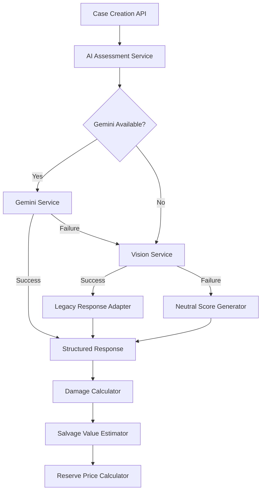
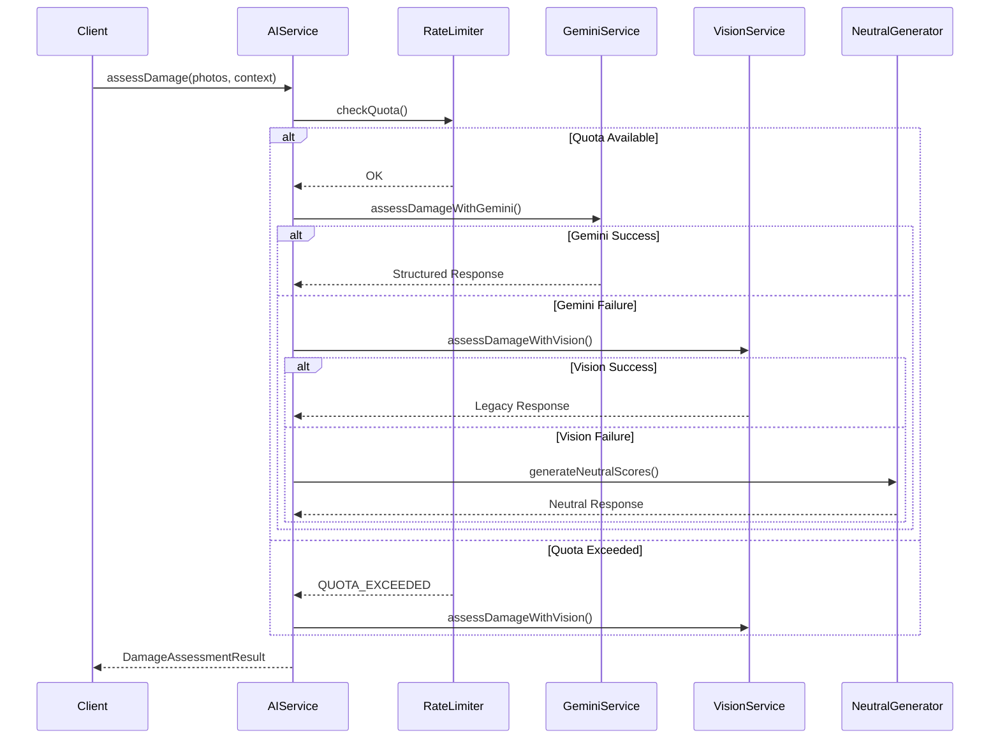
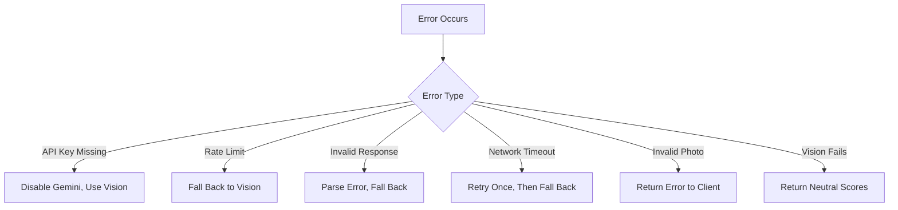

# Design Document: Gemini 2.0 Flash Damage Detection Migration

## Overview

This design document specifies the architecture and implementation details for migrating the salvage management system's AI damage detection from Google Cloud Vision API with keyword matching to Gemini 2.0 Flash multimodal AI. The migration enhances damage assessment accuracy while maintaining complete backward compatibility with existing systems through a three-tier fallback chain.

### Goals

- Improve damage assessment accuracy using Gemini 2.0 Flash's advanced multimodal capabilities
- Maintain 100% backward compatibility with existing API contracts and downstream systems
- Implement robust fallback mechanisms for resilience (Gemini → Vision → Neutral)
- Respect Gemini's free tier rate limits (10 requests/minute, 1,500 requests/day)
- Preserve all existing functions without modification (identifyDamagedComponents, calculateSalvageValue, etc.)
- Enable transparent migration with zero breaking changes

### Non-Goals

- Modifying existing damage calculation logic or database schemas
- Changing API response formats or data types
- Implementing custom rate limiting infrastructure (use in-memory counters)
- Building a custom multimodal AI model
- Replacing Google Cloud Vision API entirely (it remains as fallback)

## Architecture

### High-Level Architecture



### Service Layer Architecture

```mermaid
graph LR
    A[ai-assessment.service.ts] --> B[gemini-damage-detection.service.ts]
    A --> C[vision-damage-detection.service.ts]
    A --> D[rate-limiter.service.ts]
    B --> E[@google/generative-ai SDK]
    C --> F[@google-cloud/vision SDK]
    D --> G[In-Memory Counter]
```

### Fallback Chain Flow



## Components and Interfaces

### 1. Gemini Damage Detection Service

**File**: `src/lib/integrations/gemini-damage-detection.ts`

**Purpose**: Interface with Gemini 2.0 Flash API for multimodal damage assessment

**Interface**:

```typescript
export interface GeminiDamageAssessment {
  structural: number;        // 0-100
  mechanical: number;        // 0-100
  cosmetic: number;          // 0-100
  electrical: number;        // 0-100
  interior: number;          // 0-100
  severity: 'minor' | 'moderate' | 'severe';
  airbagDeployed: boolean;
  totalLoss: boolean;
  summary: string;
  confidence: number;        // 0-100
  method: 'gemini';
}

export interface VehicleContext {
  make: string;
  model: string;
  year: number;
}

export async function assessDamageWithGemini(
  imageUrls: string[],
  vehicleContext: VehicleContext
): Promise<GeminiDamageAssessment>
```

**Key Responsibilities**:
- Initialize Gemini SDK with API key validation
- Convert image URLs to base64 for Gemini API
- Construct optimized prompts with vehicle context
- Handle up to 6 photos per request
- Parse and validate JSON responses
- Implement retry logic for transient failures
- Log all requests for monitoring

### 2. Rate Limiter Service

**File**: `src/lib/integrations/gemini-rate-limiter.ts`

**Purpose**: Enforce Gemini API rate limits (10/min, 1,500/day)

**Interface**:

```typescript
export interface RateLimitStatus {
  allowed: boolean;
  minuteRemaining: number;
  dailyRemaining: number;
  resetAt: Date;
}

export class GeminiRateLimiter {
  checkQuota(): RateLimitStatus;
  recordRequest(): void;
  getDailyUsage(): number;
  getMinuteUsage(): number;
  reset(): void;  // For testing
}
```

**Implementation Strategy**:
- Use in-memory counters (no Redis dependency)
- Sliding window for minute-based limiting
- Daily counter with UTC midnight reset
- Thread-safe operations using atomic operations
- Warning logs at 80% and 90% of daily quota

### 3. Vision Damage Detection Service (Refactored)

**File**: `src/lib/integrations/vision-damage-detection.ts`

**Purpose**: Extract existing Vision API logic for use as fallback

**Interface**:

```typescript
export interface VisionDamageAssessment {
  labels: string[];
  confidenceScore: number;
  damagePercentage: number;
  method: 'vision';
}

export async function assessDamageWithVision(
  imageUrls: string[]
): Promise<VisionDamageAssessment>
```

**Migration Notes**:
- Extract existing logic from `ai-assessment.service.ts`
- No functional changes to Vision API integration
- Maintain existing keyword matching algorithm
- Preserve mock mode support

### 4. Response Adapter

**File**: `src/features/cases/services/damage-response-adapter.ts`

**Purpose**: Convert different assessment formats to unified response

**Interface**:

```typescript
export function adaptGeminiResponse(
  geminiAssessment: GeminiDamageAssessment,
  marketValue: number
): DamageAssessmentResult

export function adaptVisionResponse(
  visionAssessment: VisionDamageAssessment,
  marketValue: number
): DamageAssessmentResult

export function generateNeutralResponse(
  marketValue: number
): DamageAssessmentResult
```

**Conversion Logic**:
- Gemini: Use structured scores directly, calculate overall damage percentage
- Vision: Use existing keyword-based damage percentage
- Neutral: Return 50 for all damage scores, 'moderate' severity

### 5. Enhanced AI Assessment Service

**File**: `src/features/cases/services/ai-assessment.service.ts` (Modified)

**Changes**:
- Add Gemini as primary assessment method
- Implement fallback chain orchestration
- Add vehicle context parameter to assessDamage()
- Maintain existing function signatures for backward compatibility
- Add confidence field indicating which method was used

**Updated Interface**:

```typescript
export interface DamageAssessmentResult {
  // Existing fields (unchanged)
  labels: string[];
  confidenceScore: number;
  damagePercentage: number;
  processedAt: Date;
  damageSeverity: 'minor' | 'moderate' | 'severe';
  estimatedSalvageValue: number;
  reservePrice: number;
  
  // New optional fields (backward compatible)
  method?: 'gemini' | 'vision' | 'neutral';
  detailedScores?: {
    structural: number;
    mechanical: number;
    cosmetic: number;
    electrical: number;
    interior: number;
  };
  airbagDeployed?: boolean;
  totalLoss?: boolean;
  summary?: string;
}

// Enhanced function signature (backward compatible)
export async function assessDamage(
  imageUrls: string[],
  marketValue: number,
  vehicleContext?: VehicleContext  // Optional for backward compatibility
): Promise<DamageAssessmentResult>
```

## Data Models

### Gemini API Request Format

```typescript
interface GeminiRequest {
  contents: [{
    parts: [
      { text: string },  // Prompt
      { inline_data: { mime_type: string, data: string } },  // Image 1
      { inline_data: { mime_type: string, data: string } },  // Image 2
      // ... up to 6 images
    ]
  }],
  generationConfig: {
    response_mime_type: "application/json",
    response_schema: GeminiResponseSchema
  }
}
```

### Gemini Response Schema

```typescript
const GeminiResponseSchema = {
  type: "object",
  properties: {
    structural: { type: "number", minimum: 0, maximum: 100 },
    mechanical: { type: "number", minimum: 0, maximum: 100 },
    cosmetic: { type: "number", minimum: 0, maximum: 100 },
    electrical: { type: "number", minimum: 0, maximum: 100 },
    interior: { type: "number", minimum: 0, maximum: 100 },
    severity: { type: "string", enum: ["minor", "moderate", "severe"] },
    airbagDeployed: { type: "boolean" },
    totalLoss: { type: "boolean" },
    summary: { type: "string", maxLength: 500 }
  },
  required: [
    "structural", "mechanical", "cosmetic", "electrical", "interior",
    "severity", "airbagDeployed", "totalLoss", "summary"
  ]
}
```

### Rate Limit State

```typescript
interface RateLimitState {
  minuteRequests: Array<{ timestamp: number }>;
  dailyCount: number;
  dailyResetAt: Date;
  lastRequestAt: Date | null;
}
```

### Damage Assessment Context

```typescript
interface AssessmentContext {
  vehicleContext?: VehicleContext;
  marketValue: number;
  imageUrls: string[];
  attemptedMethods: string[];
  errors: Array<{ method: string, error: string }>;
}
```

## Correctness Properties

*A property is a characteristic or behavior that should hold true across all valid executions of a system-essentially, a formal statement about what the system should do. Properties serve as the bridge between human-readable specifications and machine-verifiable correctness guarantees.*

Before writing the correctness properties, I need to analyze the acceptance criteria from the requirements document to determine which are testable as properties, examples, or edge cases.


### Property Reflection

After analyzing all acceptance criteria, I've identified the following redundancies and consolidations:

**Redundant Properties to Consolidate:**
1. Properties 3.4 and 14.1 both test that vehicle context is included in the prompt - combine into one
2. Properties 3.5 and 14.4 both test that JSON schema is requested - combine into one
3. Properties 4.1-4.9 and 4.10 can be combined into a single comprehensive property about response completeness and score validity
4. Properties 5.1, 5.2, and 5.5 all test the fallback chain - combine into one comprehensive fallback property
5. Properties 7.1, 7.2, 7.4 all test backward compatibility of calculation functions - combine into one
6. Properties 11.1, 11.2, 11.3, 11.4 all test API response backward compatibility - combine into one
7. Properties 12.1 and 12.2 both test photo count handling - combine into one
8. Properties 13.1, 13.2, 13.3, 13.4, 13.5 all test error handling - can be consolidated into fewer properties
9. Properties 15.1 and 15.2 both test invalid response handling - combine into one
10. Properties 15.3, 15.4, 15.5, 15.6 all test response validation - combine into one comprehensive validation property

**Final Property Set:**
After consolidation, we have the following unique, non-redundant properties:
- Damage score range invariant (covers 4.10, 15.3)
- Response completeness and structure (covers 4.1-4.9, 15.5, 15.6)
- Fallback chain execution (covers 5.1, 5.2, 5.4, 5.5)
- Rate limiting enforcement (covers 6.1)
- Backward compatibility preservation (covers 7.1, 7.2, 7.4, 11.1-11.4)
- Photo count handling (covers 3.3, 12.1, 12.2, 12.3)
- Prompt construction (covers 3.4, 14.1, 14.2-14.6)
- Response validation and fallback (covers 15.1, 15.2, 15.4)
- Assessment timeout (covers 9.3)
- Logging completeness (covers 5.3, 9.4, 10.2, 10.3)
- Error message quality (covers 13.2, 13.3, 13.4)
- Photo validation (covers 12.5)
- Damage detection accuracy (covers 8.2, 8.4)

### Property 1: Damage Score Range Invariant

*For any* damage assessment result (from Gemini, Vision, or Neutral), all damage score values (structural, mechanical, cosmetic, electrical, interior, damagePercentage) SHALL be between 0 and 100 inclusive, and if any score from Gemini is outside this range, it SHALL be clamped to the valid range.

**Validates: Requirements 4.10, 15.3**

### Property 2: Response Completeness and Structure

*For any* successful Gemini assessment, the structured response SHALL contain all required fields (structural, mechanical, cosmetic, electrical, interior, severity, airbagDeployed, totalLoss, summary) with valid types (numbers for scores, string for severity, booleans for flags, non-empty string under 500 characters for summary).

**Validates: Requirements 4.1, 4.2, 4.3, 4.4, 4.5, 4.6, 4.7, 4.8, 4.9, 15.5, 15.6**

### Property 3: Fallback Chain Execution Order

*For any* damage assessment request, if Gemini fails or is unavailable, the system SHALL attempt Vision API, and if Vision also fails, the system SHALL return neutral scores (50 for all categories, 'moderate' severity), and the response SHALL include a method field indicating which service was used ('gemini', 'vision', or 'neutral').

**Validates: Requirements 5.1, 5.2, 5.4, 5.5**

### Property 4: Rate Limiting Enforcement

*For any* 60-second time window, the number of Gemini API requests SHALL NOT exceed 10, and when the limit is reached, subsequent requests SHALL automatically fall back to Vision API without failing.

**Validates: Requirements 6.1**

### Property 5: Backward Compatibility Preservation

*For any* damage assessment request using the existing API, the response SHALL contain all existing fields (labels, confidenceScore, damagePercentage, processedAt, damageSeverity, estimatedSalvageValue, reservePrice) with the same data types as before migration, and any new fields SHALL be optional, and existing calculation functions (identifyDamagedComponents, calculateSalvageValue, reserve price calculation) SHALL produce identical results for identical inputs.

**Validates: Requirements 7.1, 7.2, 7.4, 11.1, 11.2, 11.3, 11.4**

### Property 6: Photo Count Handling

*For any* damage assessment request, if 1-6 photos are provided, all SHALL be included in the Gemini request, and if more than 6 photos are provided, only the first 6 SHALL be processed and a warning SHALL be logged.

**Validates: Requirements 3.3, 12.1, 12.2, 12.3**

### Property 7: Prompt Construction Completeness

*For any* Gemini assessment request with vehicle context, the prompt SHALL include the vehicle make, model, and year, and SHALL request all five damage categories (structural, mechanical, cosmetic, electrical, interior), and SHALL specify the JSON response schema.

**Validates: Requirements 3.4, 3.5, 14.1, 14.2, 14.4**

### Property 8: Invalid Response Handling

*For any* Gemini response that is non-JSON or missing required fields or contains invalid severity values, the system SHALL log an error, trigger the fallback chain to Vision API, and SHALL NOT return the invalid response to the caller.

**Validates: Requirements 15.1, 15.2, 15.4**

### Property 9: Assessment Timeout Guarantee

*For any* damage assessment request, regardless of which fallback level is reached (Gemini, Vision, or Neutral), the total processing time SHALL NOT exceed 30 seconds.

**Validates: Requirements 9.3**

### Property 10: Logging Completeness

*For any* damage assessment request, the system SHALL log the assessment method used ('gemini', 'vision', or 'neutral'), and for Gemini requests SHALL log the timestamp, photo count, and estimated quota usage, and for any fallback SHALL log the reason for fallback.

**Validates: Requirements 5.3, 9.4, 10.2, 10.3**

### Property 11: Error Message Descriptiveness

*For any* error condition (invalid photo format, rate limit exceeded, invalid API key), the error message SHALL clearly describe the problem and, for rate limit errors, SHALL include the retry time.

**Validates: Requirements 13.2, 13.3, 13.4**

### Property 12: Photo Format Validation

*For any* photo provided to the Gemini service, the system SHALL validate that it is a supported image format (JPEG, PNG, WebP) before sending to the API, and SHALL reject unsupported formats with a descriptive error.

**Validates: Requirements 12.5**

### Property 13: Damage Detection Accuracy Bounds

*For any* photo of a visibly damaged vehicle, the Gemini service SHALL return at least one damage category score above 30, and for any photo of an undamaged vehicle, all damage category scores SHALL be below 30.

**Validates: Requirements 8.2, 8.4**

## Error Handling

### Error Categories and Responses



### Error Handling Strategies

**1. Configuration Errors**
- **Missing API Key**: Log warning, disable Gemini service, use Vision as primary
- **Invalid API Key**: Log error on first request, fall back to Vision
- **Missing Credentials**: Graceful degradation to neutral scores

**2. Rate Limiting Errors**
- **Minute Limit Exceeded**: Queue request for next minute window (up to 5 seconds wait)
- **Daily Limit Exceeded**: Automatically switch to Vision for remainder of day
- **Quota Warnings**: Log at 80% (1,200 requests) and 90% (1,350 requests)

**3. API Response Errors**
- **Non-JSON Response**: Log full response, trigger fallback
- **Missing Required Fields**: Log validation error, trigger fallback
- **Invalid Field Values**: Attempt to sanitize (clamp scores, default severity), if unsuccessful trigger fallback
- **Timeout (>10s)**: Cancel request, trigger fallback

**4. Photo Processing Errors**
- **Invalid Format**: Return 400 error to client with supported formats list
- **File Too Large**: Return 413 error with size limit
- **Corrupted Image**: Skip image, continue with remaining photos
- **No Valid Photos**: Return 400 error to client

**5. Fallback Chain Errors**
- **Gemini Fails**: Attempt Vision API
- **Vision Fails**: Return neutral scores with method='neutral'
- **All Methods Fail**: Return 500 error with retry guidance

### Error Logging Format

```typescript
interface ErrorLog {
  timestamp: Date;
  requestId: string;
  method: 'gemini' | 'vision' | 'neutral';
  errorType: string;
  errorMessage: string;
  stackTrace?: string;
  context: {
    photoCount: number;
    vehicleContext?: VehicleContext;
    attemptedMethods: string[];
  };
}
```

### Retry Logic

**Gemini API Retries**:
- Transient errors (5xx): Retry once after 2 seconds
- Rate limit errors: Wait and retry if within acceptable delay (<5s)
- Authentication errors: No retry, immediate fallback
- Validation errors: No retry, immediate fallback

**Vision API Retries**:
- Maintain existing retry logic (no changes)
- Transient errors: Retry once after 1 second

**Timeout Configuration**:
- Gemini API: 10 second timeout per request
- Vision API: 8 second timeout per request
- Total assessment: 30 second maximum (enforced at orchestration level)

## Testing Strategy

### Dual Testing Approach

The testing strategy employs both unit tests and property-based tests to ensure comprehensive coverage:

**Unit Tests**: Focus on specific examples, edge cases, and integration points
- Specific error scenarios (missing API key, invalid response format)
- Edge cases (0 photos, 10 photos, corrupted images)
- Integration between services (Gemini → Vision fallback)
- Mock mode behavior
- Prompt construction examples

**Property-Based Tests**: Verify universal properties across all inputs
- Damage score range invariant (1000+ random assessments)
- Fallback chain execution (random failure scenarios)
- Rate limiting enforcement (burst request patterns)
- Response structure validation (random Gemini responses)
- Backward compatibility (random legacy requests)

### Property-Based Testing Configuration

**Framework**: fast-check (TypeScript property-based testing library)

**Configuration**:
```typescript
fc.assert(
  fc.property(/* generators */,  (/* inputs */) => {
    // Property assertion
  }),
  { numRuns: 100 }  // Minimum 100 iterations per property
);
```

**Test Tagging**:
Each property test must include a comment referencing the design property:
```typescript
// Feature: gemini-damage-detection-migration, Property 1: Damage Score Range Invariant
test('all damage scores are within 0-100 range', () => {
  fc.assert(/* ... */);
});
```

### Test Categories

**1. Gemini Service Tests**
- Unit: Prompt construction, response parsing, error handling
- Property: Score range validation, response completeness
- Integration: Real API calls with test images (manual verification)

**2. Rate Limiter Tests**
- Unit: Counter increment, quota checking, reset logic
- Property: Rate limit enforcement across random request patterns
- Edge: Boundary conditions (exactly 10/min, exactly 1500/day)

**3. Fallback Chain Tests**
- Unit: Each fallback scenario (Gemini fail, Vision fail, both fail)
- Property: Fallback order consistency, method field accuracy
- Integration: End-to-end with simulated failures

**4. Response Adapter Tests**
- Unit: Gemini→Unified, Vision→Unified, Neutral generation
- Property: Backward compatibility, field presence
- Edge: Missing optional fields, extreme values

**5. AI Assessment Service Tests**
- Unit: Orchestration logic, vehicle context handling
- Property: Timeout guarantee, logging completeness
- Integration: Full flow with real images

**6. Backward Compatibility Tests**
- Unit: Existing function signatures unchanged
- Property: Identical outputs for identical inputs (before/after migration)
- Integration: Legacy client simulation

### Real Vehicle Photo Testing

**Test Dataset Requirements**:
- 10+ damaged vehicle photos (varying severity)
- 3+ undamaged vehicle photos
- Photos with deployed airbags (2+)
- Total loss vehicles (2+)
- Various angles (front, side, rear, interior)
- Different lighting conditions (day, night, indoor)
- Different vehicle types (sedan, SUV, truck)

**Accuracy Validation**:
- Manual review of Gemini assessments
- Comparison with Vision API results
- Validation against known damage reports
- False positive/negative rate tracking

**Test Execution**:
```bash
# Run all tests
npm run test

# Run property-based tests only
npm run test:property -- gemini

# Run integration tests with real API
GEMINI_API_KEY=real_key npm run test:integration -- gemini

# Run with real vehicle photos
npm run test:real-photos
```

### Performance Testing

**Load Testing**:
- Simulate burst requests (20 requests in 1 minute)
- Verify rate limiting kicks in correctly
- Measure fallback latency

**Timeout Testing**:
- Simulate slow Gemini responses
- Verify 30-second total timeout
- Measure fallback overhead

**Quota Testing**:
- Simulate daily quota exhaustion
- Verify automatic Vision fallback
- Test quota reset at midnight UTC

### Monitoring and Observability

**Metrics to Track**:
- Gemini success rate
- Vision fallback rate
- Neutral fallback rate
- Average response time by method
- Daily API usage
- Error rates by type

**Logging Requirements**:
- All assessment requests (method, duration, result)
- All fallback events (reason, from→to)
- All rate limit events (warnings, exceeded)
- All errors (type, context, stack trace)

**Alerting Thresholds**:
- Gemini failure rate >20%
- Daily quota >1,200 requests (80%)
- Average response time >15 seconds
- Error rate >5%

## Implementation Plan

### Phase 1: Foundation (Week 1)

**Tasks**:
1. Install @google/generative-ai SDK
2. Add GEMINI_API_KEY to environment configuration
3. Create rate limiter service with in-memory counters
4. Write rate limiter unit tests
5. Create Gemini service stub with API key validation

**Deliverables**:
- Package.json updated
- Environment variables configured
- Rate limiter service complete with tests
- Gemini service skeleton

### Phase 2: Gemini Integration (Week 1-2)

**Tasks**:
1. Implement Gemini API client initialization
2. Build prompt construction logic with vehicle context
3. Implement photo-to-base64 conversion
4. Add JSON response parsing and validation
5. Write Gemini service unit tests
6. Test with real API and sample images

**Deliverables**:
- Gemini service fully functional
- Prompt engineering optimized
- Response validation complete
- Unit tests passing

### Phase 3: Fallback Chain (Week 2)

**Tasks**:
1. Extract Vision API logic to separate service
2. Create response adapter for format conversion
3. Implement fallback orchestration in AI assessment service
4. Add neutral score generator
5. Write fallback chain tests
6. Test all failure scenarios

**Deliverables**:
- Vision service extracted
- Response adapter complete
- Fallback chain operational
- Integration tests passing

### Phase 4: Backward Compatibility (Week 2-3)

**Tasks**:
1. Update AI assessment service with optional vehicle context
2. Add new optional fields to response type
3. Verify existing functions unchanged
4. Write backward compatibility tests
5. Test with existing client code

**Deliverables**:
- API contracts maintained
- New fields optional
- Existing functions preserved
- Compatibility tests passing

### Phase 5: Testing and Validation (Week 3)

**Tasks**:
1. Collect real vehicle photo dataset
2. Run accuracy validation tests
3. Implement property-based tests
4. Run load and performance tests
5. Verify rate limiting under load
6. Document test results

**Deliverables**:
- Test dataset collected
- All property tests passing (100+ iterations each)
- Performance benchmarks met
- Test documentation complete

### Phase 6: Monitoring and Documentation (Week 3-4)

**Tasks**:
1. Add comprehensive logging
2. Set up monitoring dashboards
3. Configure alerting thresholds
4. Update integration README
5. Write migration guide
6. Create troubleshooting guide

**Deliverables**:
- Logging complete
- Monitoring operational
- Documentation published
- Migration guide available

### Phase 7: Deployment and Rollout (Week 4)

**Tasks**:
1. Deploy to staging environment
2. Run smoke tests
3. Monitor for 48 hours
4. Deploy to production with feature flag
5. Gradual rollout (10% → 50% → 100%)
6. Monitor production metrics

**Deliverables**:
- Staging deployment successful
- Production deployment complete
- Rollout completed
- Metrics within targets

## File Structure

```
src/
├── lib/
│   └── integrations/
│       ├── gemini-damage-detection.ts          # New: Gemini API client
│       ├── gemini-rate-limiter.ts              # New: Rate limiting service
│       ├── vision-damage-detection.ts          # New: Extracted Vision logic
│       └── README.md                            # Updated: Add Gemini docs
├── features/
│   └── cases/
│       └── services/
│           ├── ai-assessment.service.ts        # Modified: Add fallback chain
│           └── damage-response-adapter.ts      # New: Response format adapter
└── types/
    └── damage-assessment.ts                     # New: Shared type definitions

tests/
├── unit/
│   ├── integrations/
│   │   ├── gemini-damage-detection.test.ts     # New: Gemini unit tests
│   │   ├── gemini-rate-limiter.test.ts         # New: Rate limiter tests
│   │   └── vision-damage-detection.test.ts     # New: Vision unit tests
│   └── cases/
│       ├── damage-response-adapter.test.ts     # New: Adapter tests
│       └── ai-assessment-fallback.test.ts      # New: Fallback tests
├── property/
│   ├── gemini-score-range.property.test.ts     # New: Property 1
│   ├── gemini-response-structure.property.test.ts  # New: Property 2
│   ├── fallback-chain.property.test.ts         # New: Property 3
│   ├── rate-limiting.property.test.ts          # New: Property 4
│   ├── backward-compatibility.property.test.ts # New: Property 5
│   └── photo-handling.property.test.ts         # New: Property 6
└── integration/
    ├── gemini-real-api.test.ts                 # New: Real API tests
    ├── fallback-chain-integration.test.ts      # New: End-to-end fallback
    └── real-vehicle-photos.test.ts             # New: Accuracy validation

scripts/
├── test-gemini-api.ts                          # New: Manual API testing
├── collect-vehicle-photos.ts                   # New: Test dataset builder
└── monitor-gemini-usage.ts                     # New: Usage tracking

.env.example                                     # Updated: Add GEMINI_API_KEY
package.json                                     # Updated: Add @google/generative-ai
```

## Security Considerations

### API Key Management

**Storage**:
- Store GEMINI_API_KEY in environment variables only
- Never commit to version control
- Use Vercel environment variables for production
- Rotate keys quarterly

**Access Control**:
- Restrict API key to server-side code only
- Never expose in client-side bundles
- Never log full API key (log last 4 characters only)
- Validate key presence at startup

### Data Privacy

**Photo Handling**:
- Photos sent to Gemini API are not stored by Google (per Gemini API terms)
- Use HTTPS for all API communications
- Validate photo content before sending (no PII in images)
- Log photo metadata only, not photo content

**Response Data**:
- Sanitize Gemini responses before storing
- Validate all fields to prevent injection attacks
- Limit summary text length to prevent abuse
- Strip any unexpected fields from responses

### Rate Limiting Security

**Abuse Prevention**:
- Enforce rate limits at service level
- Track requests per user/session
- Implement exponential backoff for repeated failures
- Log suspicious request patterns

**Quota Protection**:
- Hard limit at 1,500 requests/day
- Automatic fallback prevents quota exhaustion
- Alert on unusual usage patterns
- Manual override capability for emergencies

## Migration Strategy

### Pre-Migration Checklist

- [ ] Gemini API key obtained and configured
- [ ] All tests passing (unit, property, integration)
- [ ] Backward compatibility verified
- [ ] Performance benchmarks met
- [ ] Monitoring dashboards configured
- [ ] Rollback plan documented
- [ ] Team trained on new system

### Migration Phases

**Phase 1: Shadow Mode (Week 1)**
- Deploy Gemini service to production
- Run Gemini assessments in parallel with Vision
- Log both results for comparison
- Do not use Gemini results yet
- Validate accuracy and performance

**Phase 2: Canary Rollout (Week 2)**
- Enable Gemini for 10% of requests
- Monitor error rates and response times
- Compare accuracy with Vision baseline
- Increase to 25% if metrics are good

**Phase 3: Gradual Rollout (Week 3)**
- Increase to 50% of requests
- Monitor daily quota usage
- Validate fallback chain under load
- Increase to 75% if stable

**Phase 4: Full Rollout (Week 4)**
- Enable Gemini for 100% of requests
- Vision becomes fallback only
- Monitor for 1 week
- Declare migration complete

### Rollback Plan

**Trigger Conditions**:
- Gemini error rate >20%
- Response time >15 seconds (95th percentile)
- Accuracy degradation >10% vs Vision
- Daily quota exhausted repeatedly
- Critical bug discovered

**Rollback Procedure**:
1. Disable Gemini via feature flag (immediate)
2. System automatically falls back to Vision
3. Investigate root cause
4. Fix issue in staging
5. Re-test thoroughly
6. Resume rollout when stable

### Success Metrics

**Technical Metrics**:
- Gemini success rate >95%
- Average response time <8 seconds
- Fallback rate <5%
- Daily quota usage <1,200 requests
- Zero breaking changes to API

**Business Metrics**:
- Damage assessment accuracy >85%
- False positive rate <10%
- False negative rate <5%
- User satisfaction maintained or improved
- No increase in support tickets

## Appendix

### Gemini API Prompt Template

```
You are an expert vehicle damage assessor. Analyze the provided photos of a {year} {make} {model} and assess the damage.

Provide a comprehensive damage assessment with scores from 0-100 for each category:
- Structural: Frame, chassis, pillars, roof (0=no damage, 100=complete structural failure)
- Mechanical: Engine, transmission, suspension, drivetrain (0=no damage, 100=non-functional)
- Cosmetic: Body panels, paint, trim, glass (0=no damage, 100=completely destroyed)
- Electrical: Wiring, lights, electronics, battery (0=no damage, 100=total electrical failure)
- Interior: Seats, dashboard, controls, upholstery (0=no damage, 100=completely destroyed)

Also determine:
- Overall severity: minor (mostly cosmetic), moderate (significant but repairable), severe (extensive damage)
- Airbag deployment: true if airbags have deployed, false otherwise
- Total loss: true if repair cost would exceed 75% of vehicle value, false otherwise
- Summary: Brief description of the damage (max 500 characters)

Return your assessment as JSON matching this exact schema:
{
  "structural": number (0-100),
  "mechanical": number (0-100),
  "cosmetic": number (0-100),
  "electrical": number (0-100),
  "interior": number (0-100),
  "severity": "minor" | "moderate" | "severe",
  "airbagDeployed": boolean,
  "totalLoss": boolean,
  "summary": string
}

Examples:
- Minor damage: Small dent, scratch, broken mirror (scores 10-30)
- Moderate damage: Crumpled fender, broken headlight, deployed airbag (scores 40-60)
- Severe damage: Frame damage, engine damage, multiple deployed airbags (scores 70-90)
```

### Rate Limiting Implementation Details

**Minute-Based Limiting (Sliding Window)**:
```typescript
class SlidingWindowRateLimiter {
  private requests: number[] = [];  // Timestamps
  
  canMakeRequest(): boolean {
    const now = Date.now();
    const oneMinuteAgo = now - 60000;
    
    // Remove requests older than 1 minute
    this.requests = this.requests.filter(t => t > oneMinuteAgo);
    
    return this.requests.length < 10;
  }
  
  recordRequest(): void {
    this.requests.push(Date.now());
  }
}
```

**Daily Limiting (Counter with Reset)**:
```typescript
class DailyRateLimiter {
  private count: number = 0;
  private resetAt: Date = this.getNextMidnightUTC();
  
  canMakeRequest(): boolean {
    this.checkReset();
    return this.count < 1500;
  }
  
  recordRequest(): void {
    this.checkReset();
    this.count++;
    
    // Log warnings
    if (this.count === 1200) {
      console.warn('80% of daily Gemini quota used');
    }
    if (this.count === 1350) {
      console.warn('90% of daily Gemini quota used');
    }
  }
  
  private checkReset(): void {
    if (new Date() >= this.resetAt) {
      this.count = 0;
      this.resetAt = this.getNextMidnightUTC();
    }
  }
  
  private getNextMidnightUTC(): Date {
    const tomorrow = new Date();
    tomorrow.setUTCDate(tomorrow.getUTCDate() + 1);
    tomorrow.setUTCHours(0, 0, 0, 0);
    return tomorrow;
  }
}
```

### Monitoring Dashboard Queries

**Gemini Usage by Day**:
```sql
SELECT 
  DATE(timestamp) as date,
  COUNT(*) as requests,
  AVG(duration_ms) as avg_duration,
  SUM(CASE WHEN method = 'gemini' THEN 1 ELSE 0 END) as gemini_count,
  SUM(CASE WHEN method = 'vision' THEN 1 ELSE 0 END) as vision_count,
  SUM(CASE WHEN method = 'neutral' THEN 1 ELSE 0 END) as neutral_count
FROM damage_assessments
WHERE timestamp >= NOW() - INTERVAL '7 days'
GROUP BY DATE(timestamp)
ORDER BY date DESC;
```

**Error Rate by Type**:
```sql
SELECT 
  error_type,
  COUNT(*) as occurrences,
  COUNT(*) * 100.0 / (SELECT COUNT(*) FROM damage_assessments WHERE timestamp >= NOW() - INTERVAL '1 day') as percentage
FROM damage_assessment_errors
WHERE timestamp >= NOW() - INTERVAL '1 day'
GROUP BY error_type
ORDER BY occurrences DESC;
```

### Troubleshooting Guide

**Issue: Gemini always falls back to Vision**
- Check GEMINI_API_KEY is set correctly
- Verify API key is valid at aistudio.google.com
- Check rate limit counters (may be exhausted)
- Review error logs for authentication failures

**Issue: Responses are slow (>15 seconds)**
- Check network latency to Gemini API
- Verify photo sizes are reasonable (<5MB each)
- Check if rate limiting is causing queuing
- Review timeout configuration

**Issue: Damage scores seem inaccurate**
- Review prompt template for clarity
- Check vehicle context is being passed correctly
- Validate photo quality and angles
- Compare with Vision API results
- Review Gemini response logs for patterns

**Issue: Daily quota exhausted early**
- Check for unexpected traffic spikes
- Review request logs for abuse patterns
- Consider increasing quota or optimizing usage
- Verify rate limiter is working correctly

**Issue: Fallback chain not working**
- Check Vision API credentials
- Verify fallback logic in AI assessment service
- Review error logs for fallback triggers
- Test each fallback level independently

---

**Document Version**: 1.0  
**Last Updated**: 2024  
**Status**: Ready for Implementation
