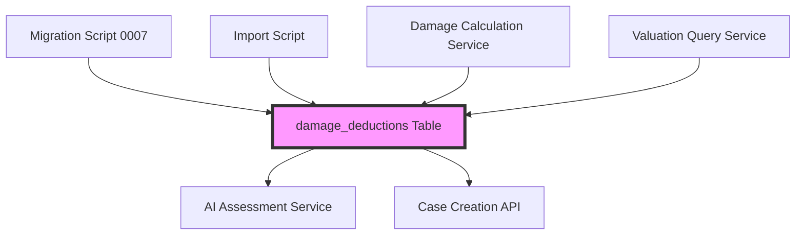

# Design Document: Make-Specific Damage Deductions

## Overview

This design extends the damage deductions system to support make-specific repair costs and valuation impacts. Currently, all damage deductions are generic across vehicle manufacturers, but repair costs vary significantly by make (e.g., Audi parts cost more than Toyota parts). This enhancement adds a nullable `make` field to the damage_deductions table, enabling the system to store and query manufacturer-specific deductions while maintaining backward compatibility with existing generic deductions.

The design includes:
- Database schema migration to add make field and range-based deduction values
- Backward-compatible data migration for existing Toyota records
- Import capability for new make-specific data (starting with Audi)
- Query logic with fallback from make-specific to generic deductions
- Validation and rollback mechanisms for data integrity

## Architecture

### System Components



### Data Flow

1. **Migration Phase**: Schema changes are applied, existing data is migrated from single-value to range-based fields
2. **Import Phase**: Make-specific deduction data is loaded via import scripts
3. **Query Phase**: Services query deductions with make-specific lookup and generic fallback
4. **Application Phase**: Damage calculation service applies deductions during vehicle valuation

### Database Schema Changes

The migration modifies the `damage_deductions` table structure:

**Before (Current Schema)**:
- component (varchar)
- damageLevel (enum)
- repairCostEstimate (decimal)
- valuationDeductionPercent (decimal)
- description (text)
- Unique constraint: (component, damageLevel)

**After (New Schema)**:
- make (varchar, nullable) - NEW
- component (varchar)
- damageLevel (enum)
- repairCostLow (decimal) - NEW
- repairCostHigh (decimal) - NEW
- valuationDeductionLow (decimal) - NEW
- valuationDeductionHigh (decimal) - NEW
- notes (text) - NEW
- Unique constraint: (make, component, damageLevel) - UPDATED

**Deprecated Fields** (removed after migration):
- repairCostEstimate
- valuationDeductionPercent
- description

## Components and Interfaces

### Migration Script (0007_add_make_specific_deductions.sql)

**Purpose**: Alter damage_deductions table schema and migrate existing data

**Operations**:
1. Add new columns (make, repairCostLow, repairCostHigh, valuationDeductionLow, valuationDeductionHigh, notes)
2. Migrate data from old columns to new columns
3. Update unique constraint to include make field
4. Add index on make field
5. Drop deprecated columns
6. Validate migration success

**Transaction Safety**: All operations wrapped in transaction with rollback on error

### Import Script (import-audi-damage-deductions.ts)

**Purpose**: Load Audi-specific damage deduction data

**Interface**:
```typescript
interface DeductionImportRecord {
  make: string;
  component: string;
  damageLevel: 'minor' | 'moderate' | 'severe';
  repairCostLow: number;
  repairCostHigh: number;
  valuationDeductionLow: number;
  valuationDeductionHigh: number;
  notes?: string;
}
```

**Behavior**:
- Upsert operation (insert or update if exists)
- Validates all numeric fields are non-negative
- Validates low values <= high values
- Logs import progress and errors

### Damage Calculation Service Updates

**Current Method**:
```typescript
async getDeduction(
  component: string, 
  damageLevel: 'minor' | 'moderate' | 'severe'
): Promise<DamageDeduction>
```

**Updated Method**:
```typescript
async getDeduction(
  component: string, 
  damageLevel: 'minor' | 'moderate' | 'severe',
  make?: string
): Promise<DamageDeduction>
```

**Query Logic**:
1. If make provided, query for (make, component, damageLevel)
2. If no result, fallback to (NULL make, component, damageLevel)
3. If still no result, use default deduction percentages
4. Use midpoint of range values for calculations

### Data Types

```typescript
interface DamageDeduction {
  component: string;
  damageLevel: 'minor' | 'moderate' | 'severe';
  make?: string;
  repairCostLow: number;
  repairCostHigh: number;
  valuationDeductionLow: number;
  valuationDeductionHigh: number;
  notes?: string;
}

interface DamageDeductionLegacy {
  component: string;
  damageLevel: 'minor' | 'moderate' | 'severe';
  repairCostEstimate: number;
  valuationDeductionPercent: number;
  description?: string;
}
```

## Data Models

### Updated damage_deductions Table Schema

```sql
CREATE TABLE damage_deductions (
  id uuid PRIMARY KEY DEFAULT gen_random_uuid(),
  make varchar(100),  -- Nullable for generic deductions
  component varchar(100) NOT NULL,
  damage_level damage_level NOT NULL,
  
  -- Range-based deduction values
  repair_cost_low numeric(12, 2) NOT NULL,
  repair_cost_high numeric(12, 2) NOT NULL,
  valuation_deduction_low numeric(12, 2) NOT NULL,
  valuation_deduction_high numeric(12, 2) NOT NULL,
  
  -- Additional context
  notes text,
  
  -- Metadata
  created_by uuid NOT NULL REFERENCES users(id),
  created_at timestamp NOT NULL DEFAULT now(),
  updated_at timestamp NOT NULL DEFAULT now(),
  
  -- Constraints
  CONSTRAINT damage_deductions_make_component_level_unique 
    UNIQUE(make, component, damage_level)
);

-- Indexes
CREATE INDEX idx_deductions_make ON damage_deductions(make);
CREATE INDEX idx_deductions_component ON damage_deductions(component);
```

### Data Migration Strategy

**Step 1: Add New Columns**
```sql
ALTER TABLE damage_deductions 
  ADD COLUMN make varchar(100),
  ADD COLUMN repair_cost_low numeric(12, 2),
  ADD COLUMN repair_cost_high numeric(12, 2),
  ADD COLUMN valuation_deduction_low numeric(12, 2),
  ADD COLUMN valuation_deduction_high numeric(12, 2),
  ADD COLUMN notes text;
```

**Step 2: Migrate Existing Data**
```sql
-- Set make to 'Toyota' for all existing records
UPDATE damage_deductions SET make = 'Toyota';

-- Copy single values to range fields
UPDATE damage_deductions 
SET 
  repair_cost_low = repair_cost_estimate,
  repair_cost_high = repair_cost_estimate,
  notes = description;

-- Calculate valuation deduction ranges
-- Assume ±10% variance around the percentage
UPDATE damage_deductions 
SET 
  valuation_deduction_low = valuation_deduction_percent * 0.90,
  valuation_deduction_high = valuation_deduction_percent * 1.10;
```

**Step 3: Update Constraints**
```sql
-- Drop old unique constraint
ALTER TABLE damage_deductions 
  DROP CONSTRAINT damage_deductions_component_damage_level_unique;

-- Add new unique constraint including make
ALTER TABLE damage_deductions 
  ADD CONSTRAINT damage_deductions_make_component_level_unique 
  UNIQUE(make, component, damage_level);
```

**Step 4: Add Indexes**
```sql
CREATE INDEX idx_deductions_make ON damage_deductions(make);
```

**Step 5: Drop Deprecated Columns**
```sql
ALTER TABLE damage_deductions 
  DROP COLUMN repair_cost_estimate,
  DROP COLUMN valuation_deduction_percent,
  DROP COLUMN description;
```

### Validation Queries

```sql
-- Verify all records have non-null make after migration
SELECT COUNT(*) FROM damage_deductions WHERE make IS NULL;
-- Expected: 0

-- Verify all range fields are populated
SELECT COUNT(*) FROM damage_deductions 
WHERE repair_cost_low IS NULL 
   OR repair_cost_high IS NULL
   OR valuation_deduction_low IS NULL
   OR valuation_deduction_high IS NULL;
-- Expected: 0

-- Verify low <= high for all ranges
SELECT COUNT(*) FROM damage_deductions 
WHERE repair_cost_low > repair_cost_high
   OR valuation_deduction_low > valuation_deduction_high;
-- Expected: 0

-- Count migrated records
SELECT COUNT(*) FROM damage_deductions WHERE make = 'Toyota';
-- Expected: 22
```


## Correctness Properties

A property is a characteristic or behavior that should hold true across all valid executions of a system—essentially, a formal statement about what the system should do. Properties serve as the bridge between human-readable specifications and machine-verifiable correctness guarantees.

### Property 1: Repair Cost Range Conversion Preserves Original Values

For any existing damage deduction record before migration, after the migration completes, both repairCostLow and repairCostHigh should equal the original repairCostEstimate value.

**Validates: Requirements 2.6, 4.3**

### Property 2: Valuation Deduction Range Calculated from Original Percentage

For any existing damage deduction record before migration, after the migration completes, valuationDeductionLow and valuationDeductionHigh should be calculated from the original valuationDeductionPercent with the low value being 90% of the original and the high value being 110% of the original.

**Validates: Requirements 4.4**

### Property 3: Description Content Migrated to Notes

For any existing damage deduction record before migration, after the migration completes, the notes field should contain the original description field content.

**Validates: Requirements 4.5**

### Property 4: All Migrated Records Have Toyota Make

For any damage deduction record that existed before migration, after the migration completes, the make field should equal 'Toyota'.

**Validates: Requirements 4.2**

### Property 5: Unique Constraint Prevents Duplicate Make-Component-Level Combinations

For any two damage deduction records with the same make, component, and damageLevel values, attempting to insert the second record should fail with a unique constraint violation.

**Validates: Requirements 3.1**

### Property 6: Different Makes Allow Same Component-Level Combinations

For any component and damageLevel combination, inserting records with different make values should all succeed without constraint violations.

**Validates: Requirements 3.2**

### Property 7: Imported Records Have Valid Data

For any record imported by the import script, the record should have: (1) make field set to the expected make value, (2) all range fields (repairCostLow, repairCostHigh, valuationDeductionLow, valuationDeductionHigh) populated with non-null numeric values, and (3) notes field populated with non-empty content.

**Validates: Requirements 5.2, 5.3, 5.4**

### Property 8: Import Script Upserts Existing Records

For any damage deduction record, if the import script is run twice with the same data, the second run should update the existing record rather than fail, and the total record count should remain unchanged.

**Validates: Requirements 5.5**

### Property 9: Make-Specific Query Returns Matching Records

For any make value, when querying damage deductions with that make, all returned records should have either the specified make value or NULL make value (generic deductions).

**Validates: Requirements 6.1**

### Property 10: Query Falls Back to Generic Deductions

For any component and damageLevel combination, if no make-specific deduction exists for a given make, querying with that make should return the generic deduction (where make IS NULL) if one exists.

**Validates: Requirements 6.2**

### Property 11: All Records Have Non-Null Make After Migration

For any damage deduction record after migration completes, the make field should not be NULL.

**Validates: Requirements 8.2**

### Property 12: All Range Fields Valid After Migration

For any damage deduction record after migration completes, all range fields (repairCostLow, repairCostHigh, valuationDeductionLow, valuationDeductionHigh) should be non-null, numeric, and satisfy the constraint that low <= high.

**Validates: Requirements 8.3**

## Error Handling

### Migration Errors

**Transaction Rollback**: All migration operations are wrapped in a database transaction. If any step fails, the entire migration is rolled back to maintain data integrity.

**Validation Failures**:
- If record count before and after migration doesn't match, rollback and report error
- If any make field is NULL after migration, rollback and report error
- If any range field is NULL or invalid after migration, rollback and report error
- If any low > high constraint is violated, rollback and report error

**Error Messages**: Migration script outputs detailed error messages including:
- Step that failed
- Number of records affected
- Specific validation that failed
- SQL error details if applicable

### Import Script Errors

**Data Validation**:
- Reject records with negative repair costs or deduction values
- Reject records where low > high for any range
- Reject records with empty make or component fields
- Log validation errors with record details

**Database Errors**:
- Catch and log unique constraint violations (should not occur with upsert)
- Catch and log foreign key violations (createdBy user must exist)
- Continue processing remaining records after individual record failures
- Report summary of successful and failed imports

**Partial Import Handling**: Import script processes records individually, so partial failures don't prevent successful records from being imported. Final summary reports:
- Total records processed
- Successful inserts
- Successful updates
- Failed records with error details

### Query Errors

**Fallback Behavior**: If database query fails, the damage calculation service falls back to default deduction percentages:
- Minor: 5%
- Moderate: 15%
- Severe: 30%

**Logging**: All query errors are logged with:
- Component and damage level requested
- Make value if provided
- Error message and stack trace
- Timestamp

**Graceful Degradation**: System continues to function with default values rather than failing completely, ensuring vehicle valuations can still be calculated even if the database is temporarily unavailable.

## Testing Strategy

This feature requires both unit tests and property-based tests to ensure correctness across all scenarios.

### Unit Testing Approach

Unit tests focus on specific examples, edge cases, and integration points:

**Migration Script Tests**:
- Verify migration runs successfully on test database
- Verify specific Toyota records are preserved with correct values
- Verify deprecated fields are removed after migration
- Verify indexes are created correctly
- Test rollback behavior when validation fails

**Import Script Tests**:
- Verify Audi import creates exactly 35 records
- Verify upsert behavior with duplicate data
- Verify validation rejects invalid data
- Test error handling and logging

**Schema Validation Tests**:
- Verify make field is nullable
- Verify unique constraint on (make, component, damageLevel)
- Verify NULL make allows one record per (component, damageLevel)
- Verify indexes exist on make and component fields

**Query Integration Tests**:
- Test make-specific query returns correct records
- Test fallback to generic deductions
- Test query with non-existent make
- Test query with NULL make

### Property-Based Testing Approach

Property tests verify universal properties across all inputs using a property-based testing library (fast-check for TypeScript). Each test runs a minimum of 100 iterations with randomized inputs.

**Test Configuration**:
- Library: fast-check
- Iterations per test: 100 minimum
- Each test tagged with: **Feature: make-specific-damage-deductions, Property {number}: {property_text}**

**Property Test Coverage**:

1. **Migration Data Preservation** (Properties 1-4, 11-12)
   - Generate random existing deduction records
   - Run migration logic
   - Verify all properties hold for all records

2. **Unique Constraint Behavior** (Properties 5-6)
   - Generate random make, component, damageLevel combinations
   - Test insertion and constraint violations
   - Verify constraint allows/prevents as expected

3. **Import Data Validity** (Properties 7-8)
   - Generate random import data
   - Run import logic
   - Verify all imported records satisfy validity properties

4. **Query Fallback Logic** (Properties 9-10)
   - Generate random database states with various deduction records
   - Query with random make values
   - Verify query results match expected fallback behavior

**Generators**:
- Make values: Random strings from ['Toyota', 'Audi', 'Honda', 'BMW', 'Mercedes', NULL]
- Components: Random strings from common vehicle parts
- Damage levels: Random from ['minor', 'moderate', 'severe']
- Numeric values: Random positive decimals within valid ranges

### Test Execution

**Unit Tests**: Run with standard test runner (Jest/Vitest)
```bash
npm test -- damage-deductions
```

**Property Tests**: Run with extended timeout due to 100+ iterations
```bash
npm test -- damage-deductions.property
```

**Integration Tests**: Run against test database with migrations applied
```bash
npm test -- damage-deductions.integration
```

### Success Criteria

- All unit tests pass
- All property tests pass with 100+ iterations
- Migration script successfully migrates test data
- Import script successfully loads Audi data
- Query service correctly implements fallback logic
- No regressions in existing damage calculation functionality
