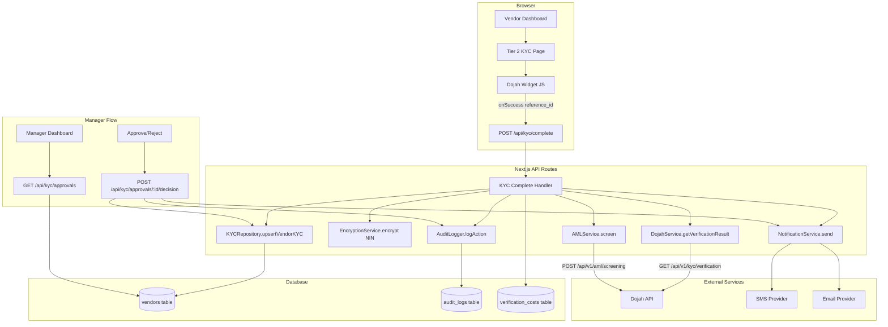

# Design Document: Tier 2 KYC Dojah Integration

## Overview

This document describes the technical design for integrating Dojah's identity verification platform into the NEM Salvage auction system to enable Tier 2 KYC upgrades for vendors.

The current Tier 2 page is a basic document upload form with no real verification. This design replaces it with a Dojah widget-powered multi-step flow that performs NIN verification, liveness check, biometric matching, document verification, and AML screening — all orchestrated through Dojah's JavaScript widget and server-side webhook/callback processing.

### Key Design Decisions

**Widget-first approach**: Rather than calling Dojah's raw REST APIs directly from the browser, we use the Dojah JavaScript widget (`widget.js`). The widget handles camera access, selfie capture, document scanning, and liveness detection natively. After the widget completes, we call `GET /api/v1/kyc/verification?reference_id=DJ-XXXXX` server-side to retrieve the full structured result. This reduces client-side complexity and keeps sensitive API keys server-side.

**Server-side result processing**: The widget's `onSuccess(response)` callback returns a `reference_id`. Our Next.js API route then fetches the full verification result from Dojah, validates it with Zod, stores it, and triggers downstream actions (AML screening, notifications, audit logging). This keeps all business logic server-side.

**Encryption at rest**: NIN and BVN are encrypted with AES-256-CBC before any database write. The encryption key lives in `ENCRYPTION_KEY` env var. The IV is prepended to the ciphertext as `{hex_iv}:{hex_ciphertext}`.

**Audit-first**: Every state transition — widget launch, verification result received, manager decision, tier change — is written to `audit_logs` before the primary record is updated.

---

## Architecture



### Data Flow Summary

1. Vendor opens `/vendor/kyc/tier2` — page loads Dojah widget config from server
2. **NEW:** Page fetches vendor data (phone from `users.phone`, BVN from `vendors.bvnEncrypted`)
3. **NEW:** Page parses vendor's full name using `NameParsingService` into first/middle/last components
4. **NEW:** Widget is initialized with parsed names (editable), phone (immutable), and BVN (immutable)
5. Vendor completes widget (NIN entry, selfie, document scan) — all handled by Dojah widget
6. **NEW:** Vendor can edit first/middle/last names in widget if parsing was incorrect
7. Widget calls `onSuccess({ reference_id: "DJ-XXXXX" })`
8. Client POSTs `reference_id` to `POST /api/kyc/complete`
9. Server fetches full result from Dojah, validates with Zod, encrypts NIN, stores to DB
10. **NEW:** Server compares submitted names against original full_name, logs significant changes for audit
11. **NEW:** Server validates phone and BVN match Tier 1 values (reject if different)
12. **NEW:** Server stores corrected names in `tier2CorrectedFirstName/MiddleName/LastName` if vendor edited them
13. Server runs AML screening, calculates fraud score, sends notifications, writes audit log
14. If auto-approved (Low risk, all scores pass): vendor tier upgraded immediately
15. If flagged: pending approval record created, managers notified
16. Manager reviews at `/manager/kyc-approvals`, approves or rejects
17. Vendor notified of final decision

---

## Components and Interfaces

### NameParsingService (`src/features/kyc/services/name-parsing.service.ts`)

Intelligent name parser that handles various cultural name formats. Nigerian names can have different structures (first-last, last-first, multiple middle names), so we parse with confidence scores and allow vendor correction.

```typescript
interface ParsedName {
  firstName: string;
  middleName?: string;
  lastName: string;
  confidence: 'high' | 'medium' | 'low';
  reasoning: string;
}

class NameParsingService {
  /**
   * Parse full name into components with cultural awareness
   * 
   * Examples:
   * - "Chukwuemeka Okonkwo" → first: "Chukwuemeka", last: "Okonkwo" (high confidence)
   * - "Okonkwo Chukwuemeka Nnamdi" → first: "Chukwuemeka", middle: "Nnamdi", last: "Okonkwo" (medium confidence)
   * - "John" → first: "John", last: "" (low confidence)
   * 
   * Strategy:
   * - 2 words: first word = first name, second word = last name (high confidence)
   * - 3+ words: first word = last name, second word = first name, rest = middle names (medium confidence)
   * - 1 word: single word = first name, empty last name (low confidence)
   * 
   * Note: All fields are editable in the Dojah widget, so this is just a best-guess pre-population
   */
  parseFullName(fullName: string): ParsedName

  /**
   * Reconstruct full name from components for display/comparison
   */
  reconstructFullName(parsed: ParsedName): string
}
```

### DojahService (`src/features/kyc/services/dojah.service.ts`)

Central service for all Dojah API interactions. Instantiated once and injected into API route handlers.

```typescript
interface DojahConfig {
  apiKey: string;
  appId: string;
  publicKey: string;
  baseUrl: string;
}

class DojahService {
  constructor(config: DojahConfig)

  // Fetch full verification result after widget completion
  getVerificationResult(referenceId: string): Promise<DojahVerificationResult>

  // Direct API methods (used for advanced lookups and AML)
  verifyNINAdvanced(nin: string): Promise<DojahNINAdvancedResult>
  screenAML(fullName: string, dateOfBirth: string): Promise<DojahAMLResult>
  verifyCAC(rcNumber: string): Promise<DojahCACResult>

  // Internal: fetch with retry + exponential backoff
  private fetchWithRetry(url: string, options: RequestInit, retries?: number): Promise<Response>
}
```

### EncryptionService (`src/features/kyc/services/encryption.service.ts`)

AES-256-CBC encryption for NIN and BVN. Stateless utility class.

```typescript
class EncryptionService {
  encrypt(plaintext: string): string   // returns "{hex_iv}:{hex_ciphertext}"
  decrypt(ciphertext: string): string  // parses "{hex_iv}:{hex_ciphertext}"
  mask(value: string): string          // returns "*******8901" style masking
}
```

### KYCRepository (`src/features/kyc/repositories/kyc.repository.ts`)

Database access layer for all KYC-related vendor fields. Uses Drizzle ORM.

```typescript
class KYCRepository {
  upsertVerificationData(vendorId: string, data: KYCVerificationData): Promise<void>
  getVerificationStatus(vendorId: string): Promise<KYCStatus>
  getPendingApprovals(): Promise<PendingApproval[]>
  recordDecision(vendorId: string, decision: ManagerDecision): Promise<void>
  recordVerificationCost(vendorId: string, cost: VerificationCost): Promise<void>
}
```

### KYC API Routes (`src/app/api/kyc/`)

| Route | Method | Description |
|---|---|---|
| `/api/kyc/widget-config` | GET | Returns Dojah widget config (app_id, p_key, widget_id) |
| `/api/kyc/complete` | POST | Receives reference_id, fetches result, processes verification |
| `/api/kyc/status` | GET | Returns current KYC status for authenticated vendor |
| `/api/kyc/approvals` | GET | Manager: list pending approvals |
| `/api/kyc/approvals/[id]/decision` | POST | Manager: approve or reject |
| `/api/kyc/costs` | GET | Finance: monthly cost report |
| `/api/health/kyc` | GET | Health check for Dojah connectivity |

### Tier 2 KYC Page (`src/app/(dashboard)/vendor/kyc/tier2/page.tsx`)

Replaces the existing basic form. New responsibilities:
- Fetch widget config from `/api/kyc/widget-config`
- Fetch vendor data (phone, BVN, full name) from authenticated session
- Parse full name using `NameParsingService` to extract first/middle/last names
- Load Dojah widget script via `<Script>` tag
- Initialize widget with config, parsed names, phone (immutable), BVN (immutable), and callbacks
- On `onSuccess`: POST reference_id to `/api/kyc/complete`, poll for result
- Display status states: idle, in-progress, pending-review, approved, rejected

**Widget Configuration Updates:**

```typescript
// Current (BROKEN):
const nameParts = (user?.name ?? '').split(' ');
const options: DojahWidgetOptions = {
  user_data: {
    first_name: nameParts[0],
    last_name: nameParts.slice(1).join(' ') || undefined,
    email: user?.email ?? undefined,
  },
  // ...
};

// New (FIXED):
import { NameParsingService } from '@/features/kyc/services/name-parsing.service';

const nameParser = new NameParsingService();
const parsedName = nameParser.parseFullName(user?.name ?? '');

const options: DojahWidgetOptions = {
  user_data: {
    first_name: parsedName.firstName,
    middle_name: parsedName.middleName,
    last_name: parsedName.lastName,
    phone: vendor?.phone, // From Tier 1 BVN verification - IMMUTABLE
    bvn: vendor?.bvnNumber, // From Tier 1 - IMMUTABLE (if Dojah supports)
    email: user?.email ?? undefined,
  },
  config: {
    // Make phone and BVN read-only in the widget
    otp: {
      phone_number: vendor?.phone,
      phone_number_editable: false, // IMMUTABLE
    },
    // Note: Check Dojah documentation for exact field names and immutability options
  },
  // ...
};
```

**Field Editability Rules:**
- **first_name**: Editable (vendor can correct parsing errors)
- **middle_name**: Editable (vendor can correct parsing errors)
- **last_name**: Editable (vendor can correct parsing errors)
- **phone**: Read-only/immutable (already verified in Tier 1)
- **bvn**: Read-only/immutable (already verified in Tier 1)
- **email**: Pre-filled but may be editable depending on Dojah widget behavior

### Dojah Widget Options Interface

Updated interface to include all required fields with immutability specifications:

```typescript
interface DojahWidgetOptions {
  app_id: string;
  p_key: string;
  type: string;
  widget_id?: string;
  user_data?: {
    first_name?: string;        // Editable - vendor can correct
    middle_name?: string;        // Editable - vendor can correct (NEW)
    last_name?: string;          // Editable - vendor can correct
    phone?: string;              // Immutable - from Tier 1 BVN verification (NEW)
    bvn?: string;                // Immutable - from Tier 1 (NEW, if supported by Dojah)
    dob?: string;
    email?: string;
  };
  config?: {
    otp?: {
      phone_number?: string;           // Pre-filled phone from Tier 1
      phone_number_editable?: boolean; // Set to false for immutability
    };
    // Additional Dojah configuration options for field immutability
    // Consult Dojah documentation for exact field names
  };
  metadata?: Record<string, string>;
  onSuccess: (response: { reference_id?: string }) => void;
  onError: (err: unknown) => void;
  onClose: () => void;
}
```

**Dojah Documentation Research Required:**

The implementation team must consult Dojah's official widget documentation to determine:
1. The exact parameter names for making fields read-only/immutable
2. Whether BVN can be pre-filled and made immutable in the widget
3. The correct configuration structure for field-level editability controls
4. Any widget version requirements for these features

If Dojah does not support field-level immutability through widget configuration, implement client-side validation to warn users if they attempt to change phone/BVN fields, and server-side validation to reject submissions where phone/BVN differ from Tier 1 values.

### Manager Approvals UI (`src/app/(dashboard)/manager/kyc-approvals/`)

New pages for Salvage Manager role:
- `page.tsx`: List of pending applications with filter/sort
- `[id]/page.tsx`: Detail view with document previews, verification scores, AML data, approve/reject form

### Cron Job (`src/app/api/cron/kyc-expiry/route.ts`)

Daily job (triggered by Vercel Cron or external scheduler) that:
1. Queries vendors where `tier2_approved_at + 12 months <= now`
2. Downgrades tier to `tier1_bvn`
3. Sends expiry notifications
4. Writes audit log entries

---

## Data Models

### Vendors Table Extensions

The existing `vendors` table needs 25 new columns. These are added via a Drizzle migration.

**Note on Phone and BVN Storage:**
- Phone number is stored in the `users` table (`users.phone`) and is already verified during Tier 1 BVN verification
- BVN is stored encrypted in the `vendors` table (`vendors.bvnEncrypted`) and is already verified during Tier 1
- Both fields should be fetched from existing records and passed to Dojah widget as immutable

```typescript
// New columns added to vendors table in src/lib/db/schema/vendors.ts

// NIN verification
ninEncrypted: varchar('nin_encrypted', { length: 500 }),         // AES-256 encrypted
ninVerificationData: jsonb('nin_verification_data'),              // Full NIMC response
ninVerifiedAt: timestamp('nin_verified_at'),                      // Already exists, keep

// Photo ID
photoIdUrl: varchar('photo_id_url', { length: 500 }),
photoIdType: varchar('photo_id_type', { length: 50 }),           // passport|voters_card|drivers_license
photoIdVerifiedAt: timestamp('photo_id_verified_at'),

// Biometrics
selfieUrl: varchar('selfie_url', { length: 500 }),
livenessScore: numeric('liveness_score', { precision: 5, scale: 2 }),
biometricMatchScore: numeric('biometric_match_score', { precision: 5, scale: 2 }),
biometricVerifiedAt: timestamp('biometric_verified_at'),

// Address proof
addressProofUrl: varchar('address_proof_url', { length: 500 }),
addressVerifiedAt: timestamp('address_verified_at'),

// AML
amlScreeningData: jsonb('aml_screening_data'),
amlRiskLevel: varchar('aml_risk_level', { length: 20 }),         // Low|Medium|High
amlScreenedAt: timestamp('aml_screened_at'),

// Business
businessType: varchar('business_type', { length: 50 }),          // individual|sole_proprietor|limited_company
cacForm7Url: varchar('cac_form7_url', { length: 500 }),
directorIds: jsonb('director_ids'),

// Tier 2 workflow
tier2SubmittedAt: timestamp('tier2_submitted_at'),
tier2ApprovedAt: timestamp('tier2_approved_at'),
tier2ApprovedBy: uuid('tier2_approved_by').references(() => users.id),
tier2RejectionReason: text('tier2_rejection_reason'),
tier2ExpiresAt: timestamp('tier2_expires_at'),                   // approved_at + 12 months
tier2DojahReferenceId: varchar('tier2_dojah_reference_id', { length: 100 }),

// Name correction tracking (NEW)
// Store vendor-corrected names from Dojah widget if they differ from parsed full_name
tier2CorrectedFirstName: varchar('tier2_corrected_first_name', { length: 100 }),
tier2CorrectedMiddleName: varchar('tier2_corrected_middle_name', { length: 100 }),
tier2CorrectedLastName: varchar('tier2_corrected_last_name', { length: 100 }),

// Fraud
fraudRiskScore: numeric('fraud_risk_score', { precision: 5, scale: 2 }),
fraudFlags: jsonb('fraud_flags'),                                 // array of flag objects
```

### Verification Costs Table (new)

```typescript
// src/lib/db/schema/verification-costs.ts
export const verificationCosts = pgTable('verification_costs', {
  id: uuid('id').primaryKey().defaultRandom(),
  vendorId: uuid('vendor_id').notNull().references(() => vendors.id),
  verificationType: varchar('verification_type', { length: 50 }).notNull(),
  costAmount: numeric('cost_amount', { precision: 10, scale: 2 }).notNull(),
  currency: varchar('currency', { length: 3 }).notNull().default('NGN'),
  dojahReferenceId: varchar('dojah_reference_id', { length: 100 }),
  createdAt: timestamp('created_at').notNull().defaultNow(),
});
```

### Zod Schemas for Dojah Responses

```typescript
// src/features/kyc/schemas/dojah.schemas.ts

const DojahNINEntitySchema = z.object({
  first_name: z.string(),
  last_name: z.string(),
  middle_name: z.string().optional(),
  date_of_birth: z.string(),
  gender: z.string().optional(),
  phone: z.string().optional(),
  photo: z.string().optional(),
});

const DojahVerificationResultSchema = z.object({
  data: z.object({
    id: z.string(),
    verification_status: z.string(),
    government_data: z.object({
      data: z.object({
        nin: z.object({
          entity: DojahNINEntitySchema,
        }).optional(),
      }),
    }).optional(),
    selfie: z.object({
      liveness_score: z.number().min(0).max(100),
      match_score: z.number().min(0).max(100),
      selfie_url: z.string().url(),
    }).optional(),
    aml: z.object({
      status: z.string(),
      pep: z.array(z.unknown()).optional(),
      sanctions: z.array(z.unknown()).optional(),
      adverse_media: z.array(z.unknown()).optional(),
    }).optional(),
  }),
});

const DojahAMLResultSchema = z.object({
  entity: z.object({
    pep: z.array(z.unknown()),
    sanctions: z.array(z.unknown()),
    adverse_media: z.array(z.unknown()),
  }),
});
```

### KYC Status Type

```typescript
// src/features/kyc/types/kyc.types.ts

type KYCVerificationStatus =
  | 'not_started'
  | 'in_progress'
  | 'pending_review'
  | 'approved'
  | 'rejected'
  | 'expired';

interface KYCStatus {
  status: KYCVerificationStatus;
  tier: 'tier1_bvn' | 'tier2_full';
  submittedAt?: Date;
  approvedAt?: Date;
  expiresAt?: Date;
  rejectionReason?: string;
  amlRiskLevel?: 'Low' | 'Medium' | 'High';
  steps: {
    nin: boolean;
    liveness: boolean;
    biometric: boolean;
    document: boolean;
    aml: boolean;
  };
}
```

---

## Correctness Properties

*A property is a characteristic or behavior that should hold true across all valid executions of a system — essentially, a formal statement about what the system should do. Properties serve as the bridge between human-readable specifications and machine-verifiable correctness guarantees.*

### Property 1: NIN Encryption Round-Trip

*For any* valid 11-digit NIN string, decrypting the result of encrypting it must return the original NIN unchanged.

`decrypt(encrypt(nin)) === nin`

**Validates: Requirements 1.7, 11.1, 11.9**

---

### Property 2: NIN Verification Caching Idempotence

*For any* NIN that has been successfully verified within the last 24 hours, calling `verifyNIN` again must return the same result without making a new Dojah API call.

**Validates: Requirements 1.10, 13.1, 13.2**

---

### Property 3: NIN Format Validation

*For any* string input to the NIN validator, the result must be `true` if and only if the string consists of exactly 11 decimal digits and `false` for all other inputs (wrong length, non-digit characters, empty string).

**Validates: Requirements 1.1, 1.2**

---

### Property 4: Name Fuzzy Match Threshold

*For any* pair of name strings, the fuzzy match function must return `true` if and only if the similarity score is 80% or above, and `false` otherwise. The function must be deterministic — the same pair always returns the same result.

**Validates: Requirements 1.5, 1.6**

---

### Property 5: Dojah Response Parsing Completeness

*For any* valid Dojah API response object, parsing it through the Zod schema must succeed and the resulting typed object must contain all required fields (first_name, last_name, date_of_birth for NIN; liveness_score, match_score for biometrics). Additionally, `parse(format(response))` must equal the original response (round-trip).

**Validates: Requirements 1.4, 4.6, 25.3, 25.6**

---

### Property 6: Liveness and Biometric Score Thresholds

*For any* liveness score in [0, 100], the liveness check must pass if and only if the score is ≥ 50. *For any* biometric match score in [0, 100], the biometric check must pass if and only if the score is ≥ 80. Both scores must always be within the [0, 100] range.

**Validates: Requirements 3.5, 3.6, 3.9**

---

### Property 7: Document Expiry Validation

*For any* document with an extracted expiry date, the validation must return `false` (expired) if the expiry date is before today's date, and `true` (valid) if the expiry date is today or in the future.

**Validates: Requirements 4.7**

---

### Property 8: Utility Bill Recency Validation

*For any* utility bill with an extracted bill date, the validation must return `true` if and only if the bill date is within the last 3 calendar months from today.

**Validates: Requirements 5.6**

---

### Property 9: AML Risk Classification Consistency

*For any* AML screening result:
- If `sanctions.length > 0`, then `riskLevel === "High"` (and upgrade is blocked)
- If `pep.length > 0` (and no sanctions), then `riskLevel === "High"`
- If `adverse_media` contains terrorism or financial crime entries (and no PEP/sanctions), then `riskLevel === "High"`
- If `adverse_media` contains only organized/violent crime entries (and no PEP/sanctions), then `riskLevel === "Medium"`
- If all arrays are empty, then `riskLevel === "Low"`

**Validates: Requirements 7.4, 7.5, 7.8**

---

### Property 10: Tier-Based Bid Limit Enforcement

*For any* vendor with tier `tier1_bvn` and any bid amount, the bid must be blocked if and only if the amount exceeds ₦500,000. *For any* vendor with tier `tier2_full`, all bid amounts must be allowed.

**Validates: Requirements 10.1, 10.2**

---

### Property 11: Encryption IV Uniqueness

*For any* two separate encryptions of the same plaintext value, the initialization vectors (IVs) must be different. This ensures that identical plaintexts produce different ciphertexts.

**Validates: Requirements 11.3**

---

### Property 12: NIN and BVN Masking

*For any* NIN or BVN string of length N, the masking function must return a string of the same length where the first (N-4) characters are asterisks and the last 4 characters are unchanged.

**Validates: Requirements 11.8**

---

### Property 13: Tier 2 Expiry Downgrade

*For any* vendor where `tier2_expires_at` is in the past, the cron job must set their tier to `tier1_bvn`. *For any* vendor where `tier2_expires_at` is in the future or null, the cron job must not change their tier.

**Validates: Requirements 20.4**

---

### Property 14: Fraud Risk Score Bounds

*For any* set of verification signals passed to the fraud scoring function, the resulting composite fraud risk score must be in the range [0, 100] inclusive.

**Validates: Requirements 28.7**

---

### Property 15: File Size Validation

*For any* uploaded file, the validation must return `false` (rejected) if the file size exceeds the configured limit (5MB for Photo ID, 10MB for utility bill/CAC), and `true` (accepted) otherwise.

**Validates: Requirements 4.2, 5.1, 6.2**

---

### Property 16: Cloudinary Folder Path Correctness

*For any* vendor ID and document type, the Cloudinary upload folder path must follow the pattern `kyc-documents/{vendorId}/{documentType}` exactly, with no trailing slashes or extra path segments.

**Validates: Requirements 3.3, 4.4, 5.3, 6.3**

---

### Property 17: Name Parsing Round-Trip Consistency

*For any* full name string, reconstructing the full name from parsed components must preserve the essential name information (allowing for whitespace normalization and word order adjustments).

`similarity(fullName, reconstructFullName(parseFullName(fullName))) >= 0.9`

**Validates: Name parsing correctness**

---

### Property 18: Phone Number Immutability Enforcement

*For any* Tier 2 verification submission, if the submitted phone number differs from the vendor's Tier 1 verified phone number, the submission must be rejected.

`submittedPhone !== tier1Phone` implies `verificationStatus === "rejected"`

**Validates: Phone number immutability requirement**

---

### Property 19: BVN Immutability Enforcement

*For any* Tier 2 verification submission, if the submitted BVN differs from the vendor's Tier 1 verified BVN, the submission must be rejected.

`submittedBVN !== tier1BVN` implies `verificationStatus === "rejected"`

**Validates: BVN immutability requirement**

---

### Property 20: Name Correction Audit Trail

*For any* Tier 2 verification where the vendor edits their name in the Dojah widget, the system must log both the original parsed names and the corrected names in the audit trail.

`correctedName !== parsedName` implies `auditLog.contains(originalName AND correctedName)`

**Validates: Name correction tracking requirement**

---

## Error Handling

### Name Parsing and Validation

| Scenario | Handling Strategy |
|---|---|
| Single-word name | Parse as first name only, flag low confidence, allow vendor to add last name in widget |
| Very long name (>5 words) | Parse first word as last name, second as first name, rest as middle names, flag medium confidence |
| Name contains special characters | Preserve special characters, normalize whitespace, validate against Dojah requirements |
| Vendor edits names significantly | Log original vs. corrected names in audit trail, flag for manager review if >50% character difference |
| Phone number mismatch | Reject submission with error: "Phone number must match your Tier 1 verified number" |
| BVN mismatch | Reject submission with error: "BVN must match your Tier 1 verified BVN" |

### Dojah API Errors

| Error Type | Handling Strategy |
|---|---|
| Network timeout (>30s) | Retry up to 3 times with exponential backoff (1s, 2s, 4s), then return 503 |
| HTTP 429 Rate Limit | Wait 60 seconds, retry once, then return 429 to client with `Retry-After` header |
| HTTP 500 Server Error | Log raw response, return user-friendly "service unavailable" message |
| Malformed JSON response | Log raw response, fail Zod validation, return structured error |
| Missing required fields | Zod parse failure, log validation errors, return 422 |

### Verification Failures

| Failure | User Message | Action |
|---|---|---|
| Invalid NIN format | "Invalid NIN format. Please enter exactly 11 digits." | Block API call |
| NIN not found | "Unable to verify NIN. Please check your NIN and try again." | Allow retry |
| Name mismatch (<80%) | "Name on NIN does not match your registered name. Please contact support." | Flag for review |
| Liveness score <50 | "Liveness check failed. Please ensure good lighting and retake your selfie." | Allow 3 retries |
| Biometric match <80% | "Face does not match ID photo. Please ensure clear photos and try again." | Flag for review |
| Expired document | "Document has expired. Please upload a valid, unexpired document." | Block submission |
| Utility bill >3 months | "Utility bill must be within the last 3 months. Please upload a recent bill." | Block submission |
| File too large | "File size exceeds {limit}MB. Please compress the file and try again." | Block upload |
| Sanctions match | Application automatically rejected, manager notified | Block upgrade |

### Transaction Safety

All multi-step verification processes use database transactions. If any step fails after documents have been uploaded to Cloudinary, the transaction rolls back the DB record but the Cloudinary files are queued for async deletion (to avoid leaving orphaned files). The vendor is returned to the step that failed.

### Concurrent Verification Prevention

A Redis lock keyed on `kyc:lock:{vendorId}` with 5-minute TTL prevents concurrent verification submissions from the same vendor. The second request receives HTTP 409 with message "Verification already in progress."

---

## Testing Strategy

### Dual Testing Approach

Both unit tests and property-based tests are required. Unit tests cover specific examples, integration points, and error conditions. Property tests verify universal correctness across all inputs.

### Property-Based Testing

**Library**: `fast-check` (TypeScript-native, works with Jest/Vitest)

Each property test must run a minimum of 100 iterations. Each test must be tagged with a comment referencing the design property it validates.

Tag format: `// Feature: tier-2-kyc-dojah-integration, Property {N}: {property_text}`

**Property test file locations**:
- `src/features/kyc/services/__tests__/encryption.service.pbt.test.ts` — Properties 1, 11, 12
- `src/features/kyc/services/__tests__/dojah.service.pbt.test.ts` — Properties 2, 3, 4, 5, 6, 7, 8, 9
- `src/features/kyc/services/__tests__/fraud.service.pbt.test.ts` — Property 14
- `src/features/kyc/services/__tests__/name-parsing.service.pbt.test.ts` — Property 17 (NEW)
- `src/features/kyc/utils/__tests__/validation.pbt.test.ts` — Properties 15, 16, 18, 19 (NEW: 18, 19)
- `src/hooks/__tests__/use-tier-upgrade.pbt.test.ts` — Property 10
- `src/app/api/cron/__tests__/kyc-expiry.pbt.test.ts` — Property 13
- `src/app/api/kyc/__tests__/complete.pbt.test.ts` — Property 20 (NEW)

**Example property test structure**:
```typescript
import fc from 'fast-check';
import { EncryptionService } from '../encryption.service';

// Feature: tier-2-kyc-dojah-integration, Property 1: NIN encryption round-trip
it('Property 1: decrypt(encrypt(nin)) === nin for all valid NINs', () => {
  const enc = new EncryptionService();
  fc.assert(
    fc.property(
      fc.stringMatching(/^\d{11}$/),
      (nin) => {
        expect(enc.decrypt(enc.encrypt(nin))).toBe(nin);
      }
    ),
    { numRuns: 100 }
  );
});

// Feature: tier-2-kyc-dojah-integration, Property 17: Name parsing round-trip consistency
it('Property 17: Name parsing preserves essential information', () => {
  const parser = new NameParsingService();
  fc.assert(
    fc.property(
      fc.array(fc.string({ minLength: 2, maxLength: 20 }), { minLength: 1, maxLength: 5 }).map(arr => arr.join(' ')),
      (fullName) => {
        const parsed = parser.parseFullName(fullName);
        const reconstructed = parser.reconstructFullName(parsed);
        const similarity = calculateSimilarity(fullName, reconstructed);
        expect(similarity).toBeGreaterThanOrEqual(0.9);
      }
    ),
    { numRuns: 100 }
  );
});

// Feature: tier-2-kyc-dojah-integration, Property 18: Phone number immutability
it('Property 18: Phone mismatch rejects verification', () => {
  fc.assert(
    fc.property(
      fc.string({ minLength: 10, maxLength: 15 }), // tier1Phone
      fc.string({ minLength: 10, maxLength: 15 }), // submittedPhone
      async (tier1Phone, submittedPhone) => {
        fc.pre(tier1Phone !== submittedPhone); // Only test when phones differ
        const result = await verifyTier2({ phone: submittedPhone }, { tier1Phone });
        expect(result.status).toBe('rejected');
        expect(result.error).toContain('Phone number must match');
      }
    ),
    { numRuns: 100 }
  );
});
```

### Unit Testing

Unit tests focus on:
- Specific Dojah API response fixtures (valid NIN, expired document, low liveness, sanctions match)
- Integration between `DojahService` → `KYCRepository` → `AuditLogger`
- **NEW:** Name parsing edge cases (single word, 5+ words, special characters, Nigerian name patterns)
- **NEW:** Phone/BVN immutability validation (reject when values differ from Tier 1)
- **NEW:** Name correction tracking (audit log entries when vendor edits names)
- Manager approval/rejection flow end-to-end
- Notification dispatch on tier change
- Error message formatting for each failure type

**Unit test file locations**:
- `src/features/kyc/services/__tests__/dojah.service.test.ts`
- `src/features/kyc/services/__tests__/name-parsing.service.test.ts` (NEW)
- `src/features/kyc/repositories/__tests__/kyc.repository.test.ts`
- `src/app/api/kyc/__tests__/complete.test.ts` (updated with phone/BVN validation tests)
- `src/app/api/kyc/__tests__/approvals.test.ts`

**Example unit tests for name parsing**:
```typescript
describe('NameParsingService', () => {
  const parser = new NameParsingService();

  it('should parse two-word names correctly', () => {
    const result = parser.parseFullName('Chukwuemeka Okonkwo');
    expect(result).toEqual({
      firstName: 'Chukwuemeka',
      lastName: 'Okonkwo',
      middleName: undefined,
      confidence: 'high',
      reasoning: 'Two-word name: first word is first name, second is last name'
    });
  });

  it('should parse three-word names with last name first', () => {
    const result = parser.parseFullName('Okonkwo Chukwuemeka Nnamdi');
    expect(result).toEqual({
      firstName: 'Chukwuemeka',
      middleName: 'Nnamdi',
      lastName: 'Okonkwo',
      confidence: 'medium',
      reasoning: 'Three+ word name: assuming last name first (Nigerian pattern)'
    });
  });

  it('should handle single-word names', () => {
    const result = parser.parseFullName('John');
    expect(result).toEqual({
      firstName: 'John',
      lastName: '',
      middleName: undefined,
      confidence: 'low',
      reasoning: 'Single word: cannot determine last name'
    });
  });
});
```

### Integration Tests

- Full Tier 2 upgrade workflow with mocked Dojah responses
- Manager approval flow with DB state verification
- Cron job expiry processing with time-mocked dates

### End-to-End Tests (Playwright)

- Happy path: vendor completes widget, gets auto-approved
- Flagged path: vendor completes widget, gets flagged, manager approves
- Rejection path: vendor gets rejected, sees rejection reason, can resubmit after 24h
- Tier enforcement: Tier 1 vendor blocked from high-value bid, sees upgrade prompt


## Implementation Approach for Name Handling and Field Immutability

### Phase 1: Name Parsing Service

1. Create `src/features/kyc/services/name-parsing.service.ts`
2. Implement parsing logic with cultural awareness:
   - 2 words: `[firstName, lastName]`
   - 3+ words: `[lastName, firstName, ...middleNames]` (Nigerian pattern)
   - 1 word: `[firstName]` with empty lastName
3. Add confidence scoring based on word count and patterns
4. Implement reconstruction function for round-trip validation
5. Write comprehensive unit tests covering edge cases

### Phase 2: Database Schema Updates

1. Add migration for new columns:
   - `tier2_corrected_first_name`
   - `tier2_corrected_middle_name`
   - `tier2_corrected_last_name`
2. Update `vendors` schema in Drizzle
3. Run migration in development and test environments

### Phase 3: Widget Configuration Updates

1. Research Dojah documentation for:
   - Field immutability configuration options
   - BVN pre-fill support
   - Phone number read-only configuration
2. Update `tier2/page.tsx`:
   - Import and use `NameParsingService`
   - Fetch vendor phone from `users.phone`
   - Fetch vendor BVN from `vendors.bvnEncrypted` (decrypt if needed for widget)
   - Parse full name into components
   - Configure widget with all fields and immutability settings
3. Add client-side warnings if Dojah doesn't support field-level immutability

### Phase 4: Server-Side Validation

1. Update `POST /api/kyc/complete` handler:
   - Fetch Tier 1 phone and BVN from database
   - Compare submitted phone/BVN against Tier 1 values
   - Reject if mismatch detected
   - Extract submitted names from Dojah response
   - Compare against parsed names
   - Store corrected names if different
   - Log name changes in audit trail
2. Add validation error responses with clear messages

### Phase 5: Audit Trail Enhancement

1. Update audit logging to capture:
   - Original parsed names
   - Vendor-corrected names (if edited)
   - Phone/BVN validation results
   - Rejection reasons for immutability violations
2. Add audit log queries for compliance reporting

### Phase 6: Testing

1. Write property-based tests for:
   - Name parsing round-trip (Property 17)
   - Phone immutability (Property 18)
   - BVN immutability (Property 19)
   - Name correction audit trail (Property 20)
2. Write unit tests for name parsing edge cases
3. Write integration tests for complete verification flow
4. Write E2E tests for name correction and immutability enforcement

### Phase 7: Documentation

1. Document name parsing algorithm and cultural considerations
2. Document Dojah widget configuration for immutability
3. Update API documentation with new validation rules
4. Create troubleshooting guide for name parsing issues

---

## Summary of Changes

This design update addresses two critical issues in the Tier 2 KYC Dojah Integration:

### 1. Name Parsing Problem (FIXED)

**Issue:** The current naive `split(' ')` approach fails for Nigerian names where the last name may come first, or there are multiple middle names.

**Solution:**
- Created `NameParsingService` with cultural awareness
- Implements intelligent parsing: 2 words = first/last, 3+ words = last/first/middle
- All name fields are editable in the Dojah widget (vendor can correct errors)
- System stores corrected names if vendor edits them
- Audit trail logs original vs. corrected names for compliance

### 2. Phone Number and BVN Immutability (FIXED)

**Issue:** Phone and BVN should be immutable since they're already verified in Tier 1, but current implementation doesn't enforce this.

**Solution:**
- Phone fetched from `users.phone` (Tier 1 verified)
- BVN fetched from `vendors.bvnEncrypted` (Tier 1 verified)
- Both pre-filled in Dojah widget and configured as read-only
- Server-side validation rejects submissions if phone/BVN differ from Tier 1
- Clear error messages guide vendors to contact support if values need updating

### New Database Columns

- `tier2_corrected_first_name` - Stores vendor-edited first name
- `tier2_corrected_middle_name` - Stores vendor-edited middle name
- `tier2_corrected_last_name` - Stores vendor-edited last name

### New Correctness Properties

- **Property 17:** Name parsing round-trip consistency
- **Property 18:** Phone number immutability enforcement
- **Property 19:** BVN immutability enforcement
- **Property 20:** Name correction audit trail

### Implementation Priority

1. **High Priority:** Name parsing service (blocks Tier 2 verification)
2. **High Priority:** Phone/BVN immutability validation (security requirement)
3. **Medium Priority:** Database schema updates (can be done in parallel)
4. **Medium Priority:** Audit trail enhancements (compliance requirement)
5. **Low Priority:** Additional E2E tests (quality assurance)

