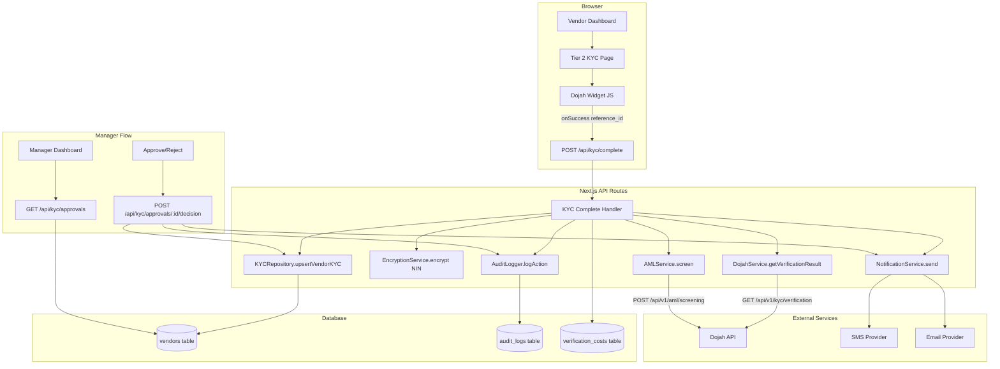

# Design Document: Tier 2 KYC Dojah Integration

## Overview

This document describes the technical design for integrating Dojah's identity verification platform into the NEM Salvage auction system to enable Tier 2 KYC upgrades for vendors.

The current Tier 2 page is a basic document upload form with no real verification. This design replaces it with a Dojah widget-powered multi-step flow that performs NIN verification, liveness check, biometric matching, document verification, and AML screening — all orchestrated through Dojah's JavaScript widget and server-side webhook/callback processing.

### Key Design Decisions

**Widget-first approach**: Rather than calling Dojah's raw REST APIs directly from the browser, we use the Dojah JavaScript widget (`widget.js`). The widget handles camera access, selfie capture, document scanning, and liveness detection natively. After the widget completes, we call `GET /api/v1/kyc/verification?reference_id=DJ-XXXXX` server-side to retrieve the full structured result. This reduces client-side complexity and keeps sensitive API keys server-side.

**Server-side result processing**: The widget's `onSuccess(response)` callback returns a `reference_id`. Our Next.js API route then fetches the full verification result from Dojah, validates it with Zod, stores it, and triggers downstream actions (AML screening, notifications, audit logging). This keeps all business logic server-side.

**Encryption at rest**: NIN and BVN are encrypted with AES-256-CBC before any database write. The encryption key lives in `ENCRYPTION_KEY` env var. The IV is prepended to the ciphertext as `{hex_iv}:{hex_ciphertext}`.

**Audit-first**: Every state transition — widget launch, verification result received, manager decision, tier change — is written to `audit_logs` before the primary record is updated.

---

## Architecture



### Data Flow Summary

1. Vendor opens `/vendor/kyc/tier2` — page loads Dojah widget config from server
2. Vendor completes widget (NIN entry, selfie, document scan) — all handled by Dojah widget
3. Widget calls `onSuccess({ reference_id: "DJ-XXXXX" })`
4. Client POSTs `reference_id` to `POST /api/kyc/complete`
5. Server fetches full result from Dojah, validates with Zod, encrypts NIN, stores to DB
6. Server runs AML screening, calculates fraud score, sends notifications, writes audit log
7. If auto-approved (Low risk, all scores pass): vendor tier upgraded immediately
8. If flagged: pending approval record created, managers notified
9. Manager reviews at `/manager/kyc-approvals`, approves or rejects
10. Vendor notified of final decision

---

## Components and Interfaces

### DojahService (`src/features/kyc/services/dojah.service.ts`)

Central service for all Dojah API interactions. Instantiated once and injected into API route handlers.

```typescript
interface DojahConfig {
  apiKey: string;
  appId: string;
  publicKey: string;
  baseUrl: string;
}

class DojahService {
  constructor(config: DojahConfig)

  // Fetch full verification result after widget completion
  getVerificationResult(referenceId: string): Promise<DojahVerificationResult>

  // Direct API methods (used for advanced lookups and AML)
  verifyNINAdvanced(nin: string): Promise<DojahNINAdvancedResult>
  screenAML(fullName: string, dateOfBirth: string): Promise<DojahAMLResult>
  verifyCAC(rcNumber: string): Promise<DojahCACResult>

  // Internal: fetch with retry + exponential backoff
  private fetchWithRetry(url: string, options: RequestInit, retries?: number): Promise<Response>
}
```

### EncryptionService (`src/features/kyc/services/encryption.service.ts`)

AES-256-CBC encryption for NIN and BVN. Stateless utility class.

```typescript
class EncryptionService {
  encrypt(plaintext: string): string   // returns "{hex_iv}:{hex_ciphertext}"
  decrypt(ciphertext: string): string  // parses "{hex_iv}:{hex_ciphertext}"
  mask(value: string): string          // returns "*******8901" style masking
}
```

### KYCRepository (`src/features/kyc/repositories/kyc.repository.ts`)

Database access layer for all KYC-related vendor fields. Uses Drizzle ORM.

```typescript
class KYCRepository {
  upsertVerificationData(vendorId: string, data: KYCVerificationData): Promise<void>
  getVerificationStatus(vendorId: string): Promise<KYCStatus>
  getPendingApprovals(): Promise<PendingApproval[]>
  recordDecision(vendorId: string, decision: ManagerDecision): Promise<void>
  recordVerificationCost(vendorId: string, cost: VerificationCost): Promise<void>
}
```

### KYC API Routes (`src/app/api/kyc/`)

| Route | Method | Description |
|---|---|---|
| `/api/kyc/widget-config` | GET | Returns Dojah widget config (app_id, p_key, widget_id) |
| `/api/kyc/complete` | POST | Receives reference_id, fetches result, processes verification |
| `/api/kyc/status` | GET | Returns current KYC status for authenticated vendor |
| `/api/kyc/approvals` | GET | Manager: list pending approvals |
| `/api/kyc/approvals/[id]/decision` | POST | Manager: approve or reject |
| `/api/kyc/costs` | GET | Finance: monthly cost report |
| `/api/health/kyc` | GET | Health check for Dojah connectivity |

### Tier 2 KYC Page (`src/app/(dashboard)/vendor/kyc/tier2/page.tsx`)

Replaces the existing basic form. New responsibilities:
- Fetch widget config from `/api/kyc/widget-config`
- Load Dojah widget script via `<Script>` tag
- Initialize widget with config and callbacks
- On `onSuccess`: POST reference_id to `/api/kyc/complete`, poll for result
- Display status states: idle, in-progress, pending-review, approved, rejected

### Manager Approvals UI (`src/app/(dashboard)/manager/kyc-approvals/`)

New pages for Salvage Manager role:
- `page.tsx`: List of pending applications with filter/sort
- `[id]/page.tsx`: Detail view with document previews, verification scores, AML data, approve/reject form

### Cron Job (`src/app/api/cron/kyc-expiry/route.ts`)

Daily job (triggered by Vercel Cron or external scheduler) that:
1. Queries vendors where `tier2_approved_at + 12 months <= now`
2. Downgrades tier to `tier1_bvn`
3. Sends expiry notifications
4. Writes audit log entries

---

## Data Models

### Vendors Table Extensions

The existing `vendors` table needs 25 new columns. These are added via a Drizzle migration.

```typescript
// New columns added to vendors table in src/lib/db/schema/vendors.ts

// NIN verification
ninEncrypted: varchar('nin_encrypted', { length: 500 }),         // AES-256 encrypted
ninVerificationData: jsonb('nin_verification_data'),              // Full NIMC response
ninVerifiedAt: timestamp('nin_verified_at'),                      // Already exists, keep

// Photo ID
photoIdUrl: varchar('photo_id_url', { length: 500 }),
photoIdType: varchar('photo_id_type', { length: 50 }),           // passport|voters_card|drivers_license
photoIdVerifiedAt: timestamp('photo_id_verified_at'),

// Biometrics
selfieUrl: varchar('selfie_url', { length: 500 }),
livenessScore: numeric('liveness_score', { precision: 5, scale: 2 }),
biometricMatchScore: numeric('biometric_match_score', { precision: 5, scale: 2 }),
biometricVerifiedAt: timestamp('biometric_verified_at'),

// Address proof
addressProofUrl: varchar('address_proof_url', { length: 500 }),
addressVerifiedAt: timestamp('address_verified_at'),

// AML
amlScreeningData: jsonb('aml_screening_data'),
amlRiskLevel: varchar('aml_risk_level', { length: 20 }),         // Low|Medium|High
amlScreenedAt: timestamp('aml_screened_at'),

// Business
businessType: varchar('business_type', { length: 50 }),          // individual|sole_proprietor|limited_company
cacForm7Url: varchar('cac_form7_url', { length: 500 }),
directorIds: jsonb('director_ids'),

// Tier 2 workflow
tier2SubmittedAt: timestamp('tier2_submitted_at'),
tier2ApprovedAt: timestamp('tier2_approved_at'),
tier2ApprovedBy: uuid('tier2_approved_by').references(() => users.id),
tier2RejectionReason: text('tier2_rejection_reason'),
tier2ExpiresAt: timestamp('tier2_expires_at'),                   // approved_at + 12 months
tier2DojahReferenceId: varchar('tier2_dojah_reference_id', { length: 100 }),

// Fraud
fraudRiskScore: numeric('fraud_risk_score', { precision: 5, scale: 2 }),
fraudFlags: jsonb('fraud_flags'),                                 // array of flag objects
```

### Verification Costs Table (new)

```typescript
// src/lib/db/schema/verification-costs.ts
export const verificationCosts = pgTable('verification_costs', {
  id: uuid('id').primaryKey().defaultRandom(),
  vendorId: uuid('vendor_id').notNull().references(() => vendors.id),
  verificationType: varchar('verification_type', { length: 50 }).notNull(),
  costAmount: numeric('cost_amount', { precision: 10, scale: 2 }).notNull(),
  currency: varchar('currency', { length: 3 }).notNull().default('NGN'),
  dojahReferenceId: varchar('dojah_reference_id', { length: 100 }),
  createdAt: timestamp('created_at').notNull().defaultNow(),
});
```

### Zod Schemas for Dojah Responses

```typescript
// src/features/kyc/schemas/dojah.schemas.ts

const DojahNINEntitySchema = z.object({
  first_name: z.string(),
  last_name: z.string(),
  middle_name: z.string().optional(),
  date_of_birth: z.string(),
  gender: z.string().optional(),
  phone: z.string().optional(),
  photo: z.string().optional(),
});

const DojahVerificationResultSchema = z.object({
  data: z.object({
    id: z.string(),
    verification_status: z.string(),
    government_data: z.object({
      data: z.object({
        nin: z.object({
          entity: DojahNINEntitySchema,
        }).optional(),
      }),
    }).optional(),
    selfie: z.object({
      liveness_score: z.number().min(0).max(100),
      match_score: z.number().min(0).max(100),
      selfie_url: z.string().url(),
    }).optional(),
    aml: z.object({
      status: z.string(),
      pep: z.array(z.unknown()).optional(),
      sanctions: z.array(z.unknown()).optional(),
      adverse_media: z.array(z.unknown()).optional(),
    }).optional(),
  }),
});

const DojahAMLResultSchema = z.object({
  entity: z.object({
    pep: z.array(z.unknown()),
    sanctions: z.array(z.unknown()),
    adverse_media: z.array(z.unknown()),
  }),
});
```

### KYC Status Type

```typescript
// src/features/kyc/types/kyc.types.ts

type KYCVerificationStatus =
  | 'not_started'
  | 'in_progress'
  | 'pending_review'
  | 'approved'
  | 'rejected'
  | 'expired';

interface KYCStatus {
  status: KYCVerificationStatus;
  tier: 'tier1_bvn' | 'tier2_full';
  submittedAt?: Date;
  approvedAt?: Date;
  expiresAt?: Date;
  rejectionReason?: string;
  amlRiskLevel?: 'Low' | 'Medium' | 'High';
  steps: {
    nin: boolean;
    liveness: boolean;
    biometric: boolean;
    document: boolean;
    aml: boolean;
  };
}
```

---

## Correctness Properties

*A property is a characteristic or behavior that should hold true across all valid executions of a system — essentially, a formal statement about what the system should do. Properties serve as the bridge between human-readable specifications and machine-verifiable correctness guarantees.*

### Property 1: NIN Encryption Round-Trip

*For any* valid 11-digit NIN string, decrypting the result of encrypting it must return the original NIN unchanged.

`decrypt(encrypt(nin)) === nin`

**Validates: Requirements 1.7, 11.1, 11.9**

---

### Property 2: NIN Verification Caching Idempotence

*For any* NIN that has been successfully verified within the last 24 hours, calling `verifyNIN` again must return the same result without making a new Dojah API call.

**Validates: Requirements 1.10, 13.1, 13.2**

---

### Property 3: NIN Format Validation

*For any* string input to the NIN validator, the result must be `true` if and only if the string consists of exactly 11 decimal digits and `false` for all other inputs (wrong length, non-digit characters, empty string).

**Validates: Requirements 1.1, 1.2**

---

### Property 4: Name Fuzzy Match Threshold

*For any* pair of name strings, the fuzzy match function must return `true` if and only if the similarity score is 80% or above, and `false` otherwise. The function must be deterministic — the same pair always returns the same result.

**Validates: Requirements 1.5, 1.6**

---

### Property 5: Dojah Response Parsing Completeness

*For any* valid Dojah API response object, parsing it through the Zod schema must succeed and the resulting typed object must contain all required fields (first_name, last_name, date_of_birth for NIN; liveness_score, match_score for biometrics). Additionally, `parse(format(response))` must equal the original response (round-trip).

**Validates: Requirements 1.4, 4.6, 25.3, 25.6**

---

### Property 6: Liveness and Biometric Score Thresholds

*For any* liveness score in [0, 100], the liveness check must pass if and only if the score is ≥ 50. *For any* biometric match score in [0, 100], the biometric check must pass if and only if the score is ≥ 80. Both scores must always be within the [0, 100] range.

**Validates: Requirements 3.5, 3.6, 3.9**

---

### Property 7: Document Expiry Validation

*For any* document with an extracted expiry date, the validation must return `false` (expired) if the expiry date is before today's date, and `true` (valid) if the expiry date is today or in the future.

**Validates: Requirements 4.7**

---

### Property 8: Utility Bill Recency Validation

*For any* utility bill with an extracted bill date, the validation must return `true` if and only if the bill date is within the last 3 calendar months from today.

**Validates: Requirements 5.6**

---

### Property 9: AML Risk Classification Consistency

*For any* AML screening result:
- If `sanctions.length > 0`, then `riskLevel === "High"` (and upgrade is blocked)
- If `pep.length > 0` (and no sanctions), then `riskLevel === "High"`
- If `adverse_media` contains terrorism or financial crime entries (and no PEP/sanctions), then `riskLevel === "High"`
- If `adverse_media` contains only organized/violent crime entries (and no PEP/sanctions), then `riskLevel === "Medium"`
- If all arrays are empty, then `riskLevel === "Low"`

**Validates: Requirements 7.4, 7.5, 7.8**

---

### Property 10: Tier-Based Bid Limit Enforcement

*For any* vendor with tier `tier1_bvn` and any bid amount, the bid must be blocked if and only if the amount exceeds ₦500,000. *For any* vendor with tier `tier2_full`, all bid amounts must be allowed.

**Validates: Requirements 10.1, 10.2**

---

### Property 11: Encryption IV Uniqueness

*For any* two separate encryptions of the same plaintext value, the initialization vectors (IVs) must be different. This ensures that identical plaintexts produce different ciphertexts.

**Validates: Requirements 11.3**

---

### Property 12: NIN and BVN Masking

*For any* NIN or BVN string of length N, the masking function must return a string of the same length where the first (N-4) characters are asterisks and the last 4 characters are unchanged.

**Validates: Requirements 11.8**

---

### Property 13: Tier 2 Expiry Downgrade

*For any* vendor where `tier2_expires_at` is in the past, the cron job must set their tier to `tier1_bvn`. *For any* vendor where `tier2_expires_at` is in the future or null, the cron job must not change their tier.

**Validates: Requirements 20.4**

---

### Property 14: Fraud Risk Score Bounds

*For any* set of verification signals passed to the fraud scoring function, the resulting composite fraud risk score must be in the range [0, 100] inclusive.

**Validates: Requirements 28.7**

---

### Property 15: File Size Validation

*For any* uploaded file, the validation must return `false` (rejected) if the file size exceeds the configured limit (5MB for Photo ID, 10MB for utility bill/CAC), and `true` (accepted) otherwise.

**Validates: Requirements 4.2, 5.1, 6.2**

---

### Property 16: Cloudinary Folder Path Correctness

*For any* vendor ID and document type, the Cloudinary upload folder path must follow the pattern `kyc-documents/{vendorId}/{documentType}` exactly, with no trailing slashes or extra path segments.

**Validates: Requirements 3.3, 4.4, 5.3, 6.3**

---

## Error Handling

### Dojah API Errors

| Error Type | Handling Strategy |
|---|---|
| Network timeout (>30s) | Retry up to 3 times with exponential backoff (1s, 2s, 4s), then return 503 |
| HTTP 429 Rate Limit | Wait 60 seconds, retry once, then return 429 to client with `Retry-After` header |
| HTTP 500 Server Error | Log raw response, return user-friendly "service unavailable" message |
| Malformed JSON response | Log raw response, fail Zod validation, return structured error |
| Missing required fields | Zod parse failure, log validation errors, return 422 |

### Verification Failures

| Failure | User Message | Action |
|---|---|---|
| Invalid NIN format | "Invalid NIN format. Please enter exactly 11 digits." | Block API call |
| NIN not found | "Unable to verify NIN. Please check your NIN and try again." | Allow retry |
| Name mismatch (<80%) | "Name on NIN does not match your registered name. Please contact support." | Flag for review |
| Liveness score <50 | "Liveness check failed. Please ensure good lighting and retake your selfie." | Allow 3 retries |
| Biometric match <80% | "Face does not match ID photo. Please ensure clear photos and try again." | Flag for review |
| Expired document | "Document has expired. Please upload a valid, unexpired document." | Block submission |
| Utility bill >3 months | "Utility bill must be within the last 3 months. Please upload a recent bill." | Block submission |
| File too large | "File size exceeds {limit}MB. Please compress the file and try again." | Block upload |
| Sanctions match | Application automatically rejected, manager notified | Block upgrade |

### Transaction Safety

All multi-step verification processes use database transactions. If any step fails after documents have been uploaded to Cloudinary, the transaction rolls back the DB record but the Cloudinary files are queued for async deletion (to avoid leaving orphaned files). The vendor is returned to the step that failed.

### Concurrent Verification Prevention

A Redis lock keyed on `kyc:lock:{vendorId}` with 5-minute TTL prevents concurrent verification submissions from the same vendor. The second request receives HTTP 409 with message "Verification already in progress."

---

## Testing Strategy

### Dual Testing Approach

Both unit tests and property-based tests are required. Unit tests cover specific examples, integration points, and error conditions. Property tests verify universal correctness across all inputs.

### Property-Based Testing

**Library**: `fast-check` (TypeScript-native, works with Jest/Vitest)

Each property test must run a minimum of 100 iterations. Each test must be tagged with a comment referencing the design property it validates.

Tag format: `// Feature: tier-2-kyc-dojah-integration, Property {N}: {property_text}`

**Property test file locations**:
- `src/features/kyc/services/__tests__/encryption.service.pbt.test.ts` — Properties 1, 11, 12
- `src/features/kyc/services/__tests__/dojah.service.pbt.test.ts` — Properties 2, 3, 4, 5, 6, 7, 8, 9
- `src/features/kyc/services/__tests__/fraud.service.pbt.test.ts` — Property 14
- `src/features/kyc/utils/__tests__/validation.pbt.test.ts` — Properties 15, 16
- `src/hooks/__tests__/use-tier-upgrade.pbt.test.ts` — Property 10
- `src/app/api/cron/__tests__/kyc-expiry.pbt.test.ts` — Property 13

**Example property test structure**:
```typescript
import fc from 'fast-check';
import { EncryptionService } from '../encryption.service';

// Feature: tier-2-kyc-dojah-integration, Property 1: NIN encryption round-trip
it('Property 1: decrypt(encrypt(nin)) === nin for all valid NINs', () => {
  const enc = new EncryptionService();
  fc.assert(
    fc.property(
      fc.stringMatching(/^\d{11}$/),
      (nin) => {
        expect(enc.decrypt(enc.encrypt(nin))).toBe(nin);
      }
    ),
    { numRuns: 100 }
  );
});
```

### Unit Testing

Unit tests focus on:
- Specific Dojah API response fixtures (valid NIN, expired document, low liveness, sanctions match)
- Integration between `DojahService` → `KYCRepository` → `AuditLogger`
- Manager approval/rejection flow end-to-end
- Notification dispatch on tier change
- Error message formatting for each failure type

**Unit test file locations**:
- `src/features/kyc/services/__tests__/dojah.service.test.ts`
- `src/features/kyc/repositories/__tests__/kyc.repository.test.ts`
- `src/app/api/kyc/__tests__/complete.test.ts`
- `src/app/api/kyc/__tests__/approvals.test.ts`

### Integration Tests

- Full Tier 2 upgrade workflow with mocked Dojah responses
- Manager approval flow with DB state verification
- Cron job expiry processing with time-mocked dates

### End-to-End Tests (Playwright)

- Happy path: vendor completes widget, gets auto-approved
- Flagged path: vendor completes widget, gets flagged, manager approves
- Rejection path: vendor gets rejected, sees rejection reason, can resubmit after 24h
- Tier enforcement: Tier 1 vendor blocked from high-value bid, sees upgrade prompt
