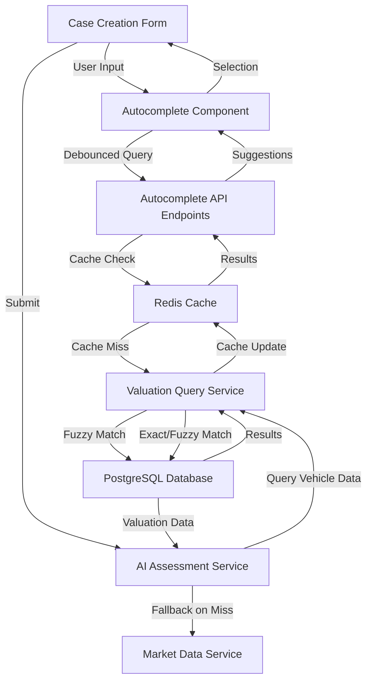

# Design Document: Vehicle Input Enhancement

## Overview

The vehicle input enhancement feature solves a critical database query matching problem in the case creation workflow. Currently, adjusters must enter vehicle make and model with exact string matching, causing the system to unnecessarily fall back to web scraping even when data exists in the database. This results in slower performance (10-15 second delays), wasted API calls, and poor user experience.

The solution implements a two-phase approach:

**Phase 1 (Backend):** Add fuzzy string matching to the Valuation Query Service to handle approximate matches (e.g., "GLE-Class GLE 350" matches "GLE 350"). This provides immediate improvement with minimal UI changes.

**Phase 2 (Frontend):** Replace text inputs with modern autocomplete components that provide real-time suggestions from the database. This improves long-term usability and accuracy.

### Success Metrics

- Reduce database query failures by 70% (from ~40% to ~12%)
- Reduce average case creation time by 30% (from 45s to 31s)
- Increase database-first query success rate from 60% to 88%
- Reduce unnecessary web scraping API calls by 65%

### Technical Context

The system currently uses exact string matching in `ValuationQueryService.queryValuation()`. When a user enters "Toyota Camry 2020" but the database contains "Camry" (without "Toyota"), the query fails and falls back to web scraping via `MarketDataService`. This is inefficient because:

1. Web scraping takes 10-15 seconds vs <200ms for database queries
2. Web scraping costs money (external API calls)
3. Web scraping is less reliable (depends on external site availability)
4. Database contains comprehensive data for popular vehicles

## Architecture

### System Components



### Data Flow

**Phase 1 (Backend Fuzzy Matching):**
1. User enters vehicle details in text inputs
2. Form submits to AI Assessment Service
3. AI Assessment Service queries Valuation Query Service
4. Valuation Query Service attempts:
   - Exact match (current behavior)
   - Fuzzy make/model match (NEW)
   - Fuzzy year match ±2 years (existing)
   - Web scraping fallback (existing)
5. Results returned to user

**Phase 2 (Autocomplete UI):**
1. User types in autocomplete input
2. Component debounces input (300ms)
3. Component calls autocomplete API endpoint
4. API checks Redis cache (1 hour TTL)
5. On cache miss, API queries database
6. Results filtered and returned (max 10 items)
7. User selects from dropdown
8. Selection cascades (make → model → year)

### Technology Stack

- **Backend:** TypeScript, Drizzle ORM, PostgreSQL
- **Fuzzy Matching:** PostgreSQL `ILIKE`, `pg_trgm` extension for trigram similarity
- **Caching:** Redis with 1-hour TTL
- **Frontend:** React, React Hook Form, Radix UI (for accessible combobox)
- **Styling:** Tailwind CSS
- **Testing:** Vitest, React Testing Library, Playwright

## Components and Interfaces

### 1. Enhanced Valuation Query Service

**File:** `src/features/valuations/services/valuation-query.service.ts`

**New Methods:**

```typescript
class ValuationQueryService {
  /**
   * Query valuation with fuzzy matching fallback chain
   * 1. Exact match
   * 2. Fuzzy make/model match
   * 3. Fuzzy year match (±2 years)
   * 4. Return not found (caller handles web scraping)
   */
  async queryValuation(params: ValuationQueryParams): Promise<ValuationResult>

  /**
   * Normalize string for fuzzy matching
   * - Convert to lowercase
   * - Trim whitespace
   * - Remove hyphens and special characters
   * - Collapse multiple spaces to single space
   */
  private normalizeString(input: string): string

  /**
   * Fuzzy match make and model using PostgreSQL ILIKE and trigram similarity
   * Returns best match with similarity score
   */
  private async fuzzyMakeModelMatch(
    make: string,
    model: string,
    year: number,
    conditionCategory?: string
  ): Promise<ValuationResult & { similarityScore?: number }>

  /**
   * Calculate similarity score between two strings using Levenshtein distance
   * Returns score from 0 (no match) to 1 (exact match)
   */
  private calculateSimilarity(str1: string, str2: string): number
}
```

**Fuzzy Matching Algorithm:**

The service will use a multi-strategy approach:

1. **String Normalization:** Convert both input and database values to lowercase, remove hyphens, trim whitespace
2. **PostgreSQL ILIKE:** Use `ILIKE '%{normalized_input}%'` for case-insensitive partial matching
3. **Trigram Similarity:** Use `pg_trgm` extension's `similarity()` function for fuzzy matching
4. **Levenshtein Distance:** Calculate edit distance for ranking multiple matches
5. **Threshold:** Only return matches with similarity score ≥ 0.6 (60%)

**Example Matches:**
- Input: "GLE-Class GLE 350" → Matches: "GLE 350" (score: 0.85)
- Input: "toyota camry" → Matches: "Camry" (score: 0.75)
- Input: "Benz E-Class" → Matches: "Mercedes-Benz E-Class" (score: 0.70)

### 2. Autocomplete API Endpoints

**File:** `src/app/api/valuations/makes/route.ts`

```typescript
/**
 * GET /api/valuations/makes
 * Returns all available vehicle makes from database
 * Cached for 1 hour in Redis
 */
export async function GET(request: Request): Promise<Response>
```

**Response:**
```json
{
  "makes": ["Audi", "Honda", "Hyundai", "Kia", "Lexus", "Mercedes-Benz", "Nissan", "Toyota"],
  "cached": true,
  "timestamp": "2025-01-15T10:30:00Z"
}
```

**File:** `src/app/api/valuations/models/route.ts`

```typescript
/**
 * GET /api/valuations/models?make={make}
 * Returns all models for specified make
 * Cached for 1 hour in Redis per make
 */
export async function GET(request: Request): Promise<Response>
```

**Response:**
```json
{
  "make": "Toyota",
  "models": ["4Runner", "Avalon", "Camry", "Corolla", "Highlander", "Land Cruiser", "Prado", "RAV4", "Sienna", "Venza"],
  "cached": true,
  "timestamp": "2025-01-15T10:30:00Z"
}
```

**File:** `src/app/api/valuations/years/route.ts`

```typescript
/**
 * GET /api/valuations/years?make={make}&model={model}
 * Returns all years for specified make and model
 * Cached for 1 hour in Redis per make/model combination
 */
export async function GET(request: Request): Promise<Response>
```

**Response:**
```json
{
  "make": "Toyota",
  "model": "Camry",
  "years": [2015, 2016, 2017, 2018, 2019, 2020, 2021, 2022, 2023, 2024],
  "cached": true,
  "timestamp": "2025-01-15T10:30:00Z"
}
```

### 3. Reusable Autocomplete Component

**File:** `src/components/ui/vehicle-autocomplete.tsx`

```typescript
interface VehicleAutocompleteProps {
  /** Field name for form integration */
  name: string
  /** Label text */
  label: string
  /** Placeholder text */
  placeholder: string
  /** Current value */
  value: string
  /** Change handler */
  onChange: (value: string) => void
  /** API endpoint to fetch suggestions */
  endpoint: string
  /** Query parameters for API call */
  queryParams?: Record<string, string>
  /** Whether field is disabled */
  disabled?: boolean
  /** Whether field is required */
  required?: boolean
  /** Error message */
  error?: string
  /** Loading state */
  isLoading?: boolean
  /** Debounce delay in ms (default: 300) */
  debounceMs?: number
  /** Maximum suggestions to display (default: 10) */
  maxSuggestions?: number
  /** Mobile mode (shows fewer suggestions) */
  isMobile?: boolean
}

export function VehicleAutocomplete(props: VehicleAutocompleteProps): JSX.Element
```

**Component Features:**
- ARIA combobox pattern with proper roles and attributes
- Keyboard navigation (Arrow Up/Down, Enter, Escape, Tab)
- Touch-friendly tap targets (44x44px minimum)
- Debounced input (300ms default)
- Loading indicator during API calls
- Error state with graceful degradation to text input
- Clear button to reset selection
- Highlight matching text in suggestions
- Mobile-optimized (5 suggestions max on small screens)

**Internal State:**
```typescript
interface AutocompleteState {
  isOpen: boolean
  suggestions: string[]
  selectedIndex: number
  isLoading: boolean
  error: string | null
  inputValue: string
}
```

### 4. Cache Service

**File:** `src/lib/cache/autocomplete-cache.ts`

```typescript
class AutocompleteCache {
  private readonly TTL = 3600 // 1 hour in seconds

  /**
   * Get cached makes list
   */
  async getMakes(): Promise<string[] | null>

  /**
   * Set cached makes list
   */
  async setMakes(makes: string[]): Promise<void>

  /**
   * Get cached models for a make
   */
  async getModels(make: string): Promise<string[] | null>

  /**
   * Set cached models for a make
   */
  async setModels(make: string, models: string[]): Promise<void>

  /**
   * Get cached years for make/model
   */
  async getYears(make: string, model: string): Promise<number[] | null>

  /**
   * Set cached years for make/model
   */
  async setYears(make: string, model: string, years: number[]): Promise<void>

  /**
   * Clear all autocomplete caches
   */
  async clearAll(): Promise<void>
}
```

**Cache Keys:**
- Makes: `autocomplete:makes`
- Models: `autocomplete:models:{make}`
- Years: `autocomplete:years:{make}:{model}`

### 5. Updated Case Creation Form

**File:** `src/app/(dashboard)/adjuster/cases/new/page.tsx`

**Changes:**
1. Replace text inputs with `VehicleAutocomplete` components
2. Add cascade logic (make selection enables model, model selection enables year)
3. Add clear logic (changing make clears model/year, changing model clears year)
4. Preserve sessionStorage integration for offline support
5. Maintain existing form validation

**Component Structure:**
```tsx
<VehicleAutocomplete
  name="vehicleMake"
  label="Vehicle Make"
  placeholder="e.g., Toyota"
  value={watch('vehicleMake') || ''}
  onChange={(value) => {
    setValue('vehicleMake', value)
    setValue('vehicleModel', '') // Clear dependent fields
    setValue('vehicleYear', undefined)
  }}
  endpoint="/api/valuations/makes"
  required
  error={errors.vehicleMake?.message}
/>

<VehicleAutocomplete
  name="vehicleModel"
  label="Vehicle Model"
  placeholder="e.g., Camry"
  value={watch('vehicleModel') || ''}
  onChange={(value) => {
    setValue('vehicleModel', value)
    setValue('vehicleYear', undefined) // Clear dependent field
  }}
  endpoint="/api/valuations/models"
  queryParams={{ make: watch('vehicleMake') || '' }}
  disabled={!watch('vehicleMake')}
  required
  error={errors.vehicleModel?.message}
/>

<VehicleAutocomplete
  name="vehicleYear"
  label="Vehicle Year"
  placeholder="e.g., 2020"
  value={watch('vehicleYear')?.toString() || ''}
  onChange={(value) => setValue('vehicleYear', parseInt(value))}
  endpoint="/api/valuations/years"
  queryParams={{
    make: watch('vehicleMake') || '',
    model: watch('vehicleModel') || ''
  }}
  disabled={!watch('vehicleMake') || !watch('vehicleModel')}
  required
  error={errors.vehicleYear?.message}
/>
```

## Data Models

### Valuation Query Result (Enhanced)

```typescript
interface ValuationResult {
  found: boolean
  valuation?: {
    lowPrice: number
    highPrice: number
    averagePrice: number
    mileageLow?: number
    mileageHigh?: number
    marketNotes?: string
    conditionCategory: string
  }
  source: 'database' | 'not_found'
  matchType?: 'exact' | 'fuzzy_make_model' | 'fuzzy_year' // NEW
  similarityScore?: number // NEW (0-1, only for fuzzy matches)
  matchedValues?: { // NEW (for debugging)
    make?: string
    model?: string
    year?: number
  }
}
```

### Autocomplete API Response

```typescript
interface AutocompleteResponse {
  /** List of suggestions */
  data: string[] | number[]
  /** Whether response was served from cache */
  cached: boolean
  /** Response timestamp */
  timestamp: string
  /** Total count of available options */
  total: number
}
```

### Fuzzy Match Log Entry

```typescript
interface FuzzyMatchLog {
  timestamp: string
  inputMake: string
  inputModel: string
  inputYear: number
  matchedMake?: string
  matchedModel?: string
  matchedYear?: number
  similarityScore: number
  matchType: 'exact' | 'fuzzy_make_model' | 'fuzzy_year'
  success: boolean
}
```

## Correctness Properties

*A property is a characteristic or behavior that should hold true across all valid executions of a system-essentially, a formal statement about what the system should do. Properties serve as the bridge between human-readable specifications and machine-verifiable correctness guarantees.*

